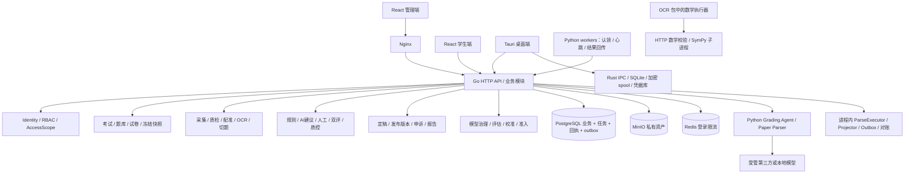
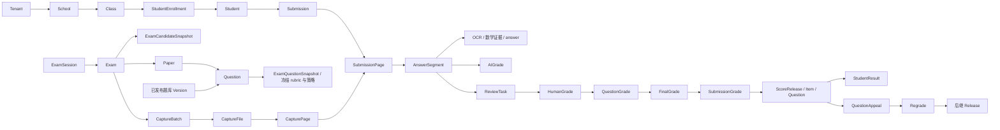

# EduGrade 仓库理解与 AI Code Review 上下文

> 建模日期：2026-09-15。仓库：D:/project/yuejuan。基准 HEAD：c3d634b50d99b131b5fc4f0719a6ed437997f613。
> 本文描述建模时的**当前工作区**，包含用户已有未提交改动；不是该提交的纯净快照。
> 本轮只进行静态架构理解，没有执行生产服务、数据库迁移、外部模型调用或全面 Bug 审查。风险列表是下一轮审查定位，不是缺陷清单。

## 0. 范围、方法与可信度

### 0.1 覆盖范围

使用 `rg --files --hidden -g !.git` 枚举受 ignore 规则约束的仓库文件；覆盖 apps、services、ai-services、packages、lab、contracts、infra、scripts、tests、docs、reports 和 .github。依赖安装目录、被忽略的缓存／输出／本地私有环境文件不属于统计对象。

建模开始时共 2,148 个可见文件；以下九类文件合计 263,230 行，包含空行、注释、测试、生成文件及迁移：

| 类型 | 文件数 | 行数 |
| --- | ---: | ---: |
| Go | 650 | 154,458 |
| Python | 124 | 23,881 |
| TypeScript | 209 | 18,710 |
| TSX | 118 | 31,486 |
| Rust | 5 | 2,785 |
| JavaScript | 71 | 6,745 |
| MJS | 25 | 1,850 |
| SQL | 152 | 12,394 |
| CSS | 12 | 10,921 |

按测试路径／文件名识别约 56,777 行测试；generated 目录约 3,248 行。上述口径减去测试与生成代码约 20.3 万行，仍包含迁移、样式和工具代码，不等同于业务有效代码行数。

后端 internal 共 **61 个包目录**；顶层 SQL 迁移 **149 份**，文件编号延伸至 000150，不能以最大编号当文件数。OpenAPI JSON 有 207 个 path、231 个 operation；对 server.go 和各 handlers 的静态 HTTP 方法／路径字符串索引得到 494 个去重字面量。后者不是运行时已注册路由的精确计数，也不能直接据此判定契约缺口，应结合 route-coverage、例外表、注册函数和契约测试。

### 0.2 采用的方法

1. 全仓文件、语言、入口、manifest、Docker／CI／配置索引。
2. 全部 Go 包的生产文件清单、真实内部 import、类型定义、导出方法、SQL 表引用、状态常量和路由字面量索引。
3. 从 server 装配根追踪实际实例、Store 注入与跨域桥接；区分 Postgres 生产装配与 Memory 测试装配。
4. 阅读三端入口、路由／能力定义、API transport、SDK、前端业务特性目录与离线 IPC。
5. 阅读所有 Python 服务的依赖声明和入口，沿 worker runner → HTTP client → Go result handler → Store 追踪任务闭环。
6. 阅读全部迁移的建表索引，并沿认证、RLS、采集、评分、发布、题库等核心路径阅读实现与约束。
7. 检索测试布局、CI 命令、脚本与实验边界。

这是**全仓模块级地图与核心链路级理解**，不是逐行语义验证。附录给出全量模块索引及模型／迁移定位，避免仅靠少数文件推断整个仓库。本文未声称每个函数已审计、每个状态转移已验证、测试全部通过或所有部署能力实际可用。

### 0.3 阅读约定

下文 `internal/<module>` 均指 `services/api-gateway/internal/<module>`。同名 `types.go`、`store_postgres.go`、`handlers.go` 是具体模块文件，而非全局公共层。附录附有本工作区可点击源码链接。

证据优先级：当前入口与装配代码 → 调用实现和 SQL → 契约与测试 → 文档／历史 Story。README、文件名、注释、部署服务声明、前端 productionReady 标记均不能单独证明功能闭环。

## 1. 技术栈

| 层面 | 已确认的实现 | 证据与边界 |
| --- | --- | --- |
| 语言 | Go、Python、TypeScript／TSX、Rust、JavaScript；SQL、PowerShell、Shell 辅助 | 实际源码及各 manifest |
| 后端 | Go 标准库 net/http、http.NewServeMux，手动依赖注入 | cmd/api-gateway/main.go、internal/server/{server,modules,infrastructure}.go；未使用 Gin／Echo |
| Go 版本 | go.mod 声明 go 1.25.12，toolchain go1.26.6 | 表示仓库声明，不表示当前机器安装版本 |
| 管理端 | React 19、TypeScript、Vite 6、Ant Design 5、TanStack Router／Query | package.json、main.tsx、App.tsx、router/appRouter.tsx；hash history + AppShell 业务视图映射 |
| 管理端配套 | Recharts、Framer Motion、Lucide、PapaParse、pdfjs-dist | 图表、交互、CSV、PDF 显示；不构成后端数据权限 |
| 学生端 | 独立 React 19／Vite／TS SPA，消费 SDK | apps/student-portal/src/{main,App}.tsx、api.ts；当前主 Compose 未单独装配学生端容器 |
| 桌面端 | Tauri 2 + React／Vite 前端 + Rust 2021 | src-tauri/Cargo.toml、tauri.conf.json、src/lib.rs；NSIS／MSI Windows 安装目标 |
| Python 服务 | Python >=3.11,<3.13 的 worker；AI 与数学服务使用标准库 HTTP server | pyproject.toml、__main__.py、server.py；不是 FastAPI／Celery |
| 数据库 | PostgreSQL；Compose 默认 PostgreSQL 16 | database/sql + pgx/v5；大量手写 SQL |
| ORM | 未发现生产 ORM | Store 是手写 Repository／DAO；部分业务事务直接在 Store 内完成 |
| 对象存储 | MinIO／S3 API | files/storage_minio.go、minioadapter；私有资产元数据在 PostgreSQL |
| 本地存储 | SQLite、加密 spool／草稿文件、Windows Credential Manager | desktop durable_store.rs、scanner.rs、keyring、aes-gcm；浏览器开发模式另有 localStorage fallback |
| Redis | Redis 7、go-redis；登录失败计数、TTL、限流探测与降级状态 | auth/login_limiter_redis.go、server/infrastructure.go；未发现 Redis Stream／List 业务队列 |
| 向量组件 | Qdrant 已部署并做健康探测 | deps/deps.go；未找到生产向量写入／检索调用，答案分组当前使用确定性文本表示 |
| 任务队列 | PostgreSQL agent_worker_task + attempt／heartbeat，租约、重试、死信 | workerruntime；不是 RabbitMQ／Kafka／Celery |
| 调度 | Go goroutine／ticker、Python polling + heartbeat thread；数学求解子进程 | infrastructure.go、各 runner、共享 LeaseHeartbeat |
| 流式通信 | 内部试卷解析支持 application/x-ndjson；前端处理进度用轮询 | grading_agent/server.py、paper/document_import.go、PaperRubricPage.tsx、useExamScoring.ts |
| WebSocket／SSE／RPC | 未发现生产业务 WebSocket／SSE／gRPC 实现；跨服务主要 HTTP JSON；桌面使用 Tauri IPC | 开发 CSP 中 ws 是 Vite HMR，不应算业务 WebSocket；Qdrant gRPC 端口不代表业务使用 gRPC |
| OCR／图像／数学 | PaddleOCR／PaddlePaddle、FormulaNet；OpenCV、Pillow、NumPy、pypdfium2、zxing-cpp；SymPy | 各 pyproject 和 engine／decoder／parser；安装与设备能力依赖 profile |
| AI API | OpenAI-compatible chat/completions、DashScope native，支持受管模型配置与本地 runtime | ai-services/grading_agent/{model,managed_model,provider_adapter}.py |
| 测试 | Go testing／httptest，Vitest，Playwright，Python pytest／unittest，Node --test，Rust cargo test | CI 和各测试目录；Memory 测试与真实 Postgres／worker 测试必须区分 |
| 构建 | npm workspaces、tsc／Vite、Go build、setuptools、Cargo／Tauri、Docker multi-stage | package.json、Dockerfile、pyproject、Cargo |
| 部署 | Docker Compose 私有部署，Nginx，按 profile 启动 workers／observability | infra/docker-compose；备份恢复、迁移锁／checksum、镜像发布 CI |
| 观测 | 结构化日志、request_id、SQL 慢查询／连接池指标、健康检查、Prometheus／Grafana | logger、observability、deps、infra |

## 2. 系统架构

项目是一个多租户考试与阅卷平台。业务后端主体是**模块化单体**，名为 api-gateway，但它拥有绝大多数业务逻辑、事务与数据访问。Python 进程承担耗时识别、解析、推理／符号计算；三端共享 HTTP 业务后端。

### 2.1 生产装配根

`main → config.Load → server.New → newInfrastructure → NewPostgresApplicationStores → NewTransactionalApplicationModules → NewRouterComplete`。

六个装配域：

- IdentityModule：认证、会话、组织。
- ExamPreparationModule：考试、试卷、题库、文件、答卷、切题、assessment、工作区。
- CaptureProcessingModule：采集、上传、OCR、图像质量、处理投影、worker runtime、orchestrator。
- GradingQualityModule：规则／主观题评分、证据、人工／双评／仲裁、金标／校准／Seed／漂移／回评／重评。
- ReleaseModule：工作成绩、发布快照、发布门禁、学生读取、申诉、统计。
- AIGovernanceModule + AIFoundation：模型配置／审批、数学理解、准入、评估、置信度校准和人机分歧。

共享 Infrastructure 管理 SQL 连接池、对象存储、Redis 限流器、依赖探针、指标和后台循环。Memory Store 及 Mock AI 是显式测试／受控环境分支，不能当生产持久化图。生产构造包含 Store 图验证和配置／模型就绪检查。

### 2.2 分层实况

常见路径有两种：

- Handler → Service → Store → SQL：如 backmark、regrade、scorerelease、gradingevaluation。
- Handler → Store／Engine → SQL：如 exam、org、review、score，以及部分 grading／capture。

因此不能机械地要求每个包都有 Controller／Service／Repository 三层。Store 除 DAO 外，还负责锁、状态机、快照、跨表写入、审计或回执；仅审 handlers 会遗漏关键业务约束。

Go import 图也不是全部业务依赖图：很多跨域关系通过 SQL JOIN、共享表、接口注入或迁移 trigger／function 实现。评审时必须同时看装配、SQL 与运行时数据流。

### 2.3 全仓目录地图

| 目录 | 定位及主要内容 |
| --- | --- |
| apps/web-admin | 管理／教师／阅卷／仲裁／审计工作台；pages、features、components、router、auth、query、api |
| apps/student-portal | 独立学生成绩、逐题答卷、统计与申诉入口 |
| apps/desktop-client | 扫描／上传、离线阅卷、同步、诊断；src-tauri 为原生安全与持久化边界 |
| services/api-gateway/cmd | HTTP 服务与 bootstrap-admin；reliability-repair 管理 CLI；测试专用 provisioning |
| services/api-gateway/internal | 61 个业务、平台与测试契约包；全量索引见附录 |
| services/api-gateway/migrations | schema、索引、外键、tenant 约束、RLS、状态／审计／投影函数；baseline 指纹 |
| services/api-gateway/openapi | OpenAPI 规范与 route-coverage 索引 |
| services/*-worker | OCR、图像质量、页面处理、主观题执行、数学校验；每个含代码、依赖、测试、部署入口 |
| ai-services | Grading Agent、试卷解析、模型 adapter、schema／能力矩阵、HTTP 边界及测试 |
| packages/sdk | OpenAPI 生成 client／types，手写 transport 协议、path/query、assessment 适配 |
| packages/shared-types | 通用概念类型；其枚举不能覆盖实际 Go／SDK 状态，需确认消费点 |
| packages/ui、design-tokens | 共享工作区组件、状态与设计 token；不是业务权限层 |
| packages/worker-runtime-python | 公共响应读取／校验、LeaseHeartbeat；所有 worker 的基础运行时 |
| contracts | Grading Agent v1/v2 schema／能力定义、OpenAPI breaking baseline／例外、响应样例 |
| lab | 隔离的 grading 实验、合成／受治理数据集、prompt、证据校验、评估、模型选择、校准／公平性、对抗、训练决策与 pilot 冻结 |
| tests | 集成共享客户端契约、Playwright 场景／fixtures、真实 worker 场景、AI evaluation |
| scripts | SDK／契约生成与检查、schema version、Story gates、启动与模拟数据生成、CI 辅助 |
| infra | Compose、Nginx、Prometheus、备份／恢复／对账／预检／smoke／校准脚本 |
| .github | CI、镜像构建／扫描／签名、依赖更新、CODEOWNERS |
| docs | 架构／Story／计划／规范／指南／历史 review；历史计划不是当前实现证据 |
| reports | OCR 评测等结果材料；结果限定于记录中的样本、参数与运行条件 |

## 3. 核心模块表

以下入口均以真实目录和符号定位；“依赖”同时注明调用方及下游。基础公共包另见附录。

| 模块 | 主要职责 | 入口 | 依赖／调用关系 | 核心数据 |
| --- | --- | --- | --- | --- |
| web-admin shell／router／auth | 身份体验、导航、会话恢复、能力显隐 | main.tsx → App → AppShell；router/routes.tsx | 用户 → 页面；调用 auth API、TanStack Query；消费 SDK | SessionUser、workspace、examId |
| web-admin pages／features | 考试准备、试卷导入、采集、阅卷质控、发布／题库 | pages/*；features/grading/workbench、paper-import、question-bank、members | shell → 特性 hooks → api/* → HTTP | 草稿、revision、commandId、处理进度 |
| student-portal | 当前公开考试／成绩、逐题证据和申诉 | App.tsx、api.ts | 学生 → SDK → student／score-release／question-appeal API | PublishedExam、StudentResult、release_id |
| desktop-client | 离线扫描 spool、上传恢复、阅卷草稿、设备诊断 | App.tsx、OfflineWorkbench、src/lib、src-tauri/src/lib.rs | React ↔ Tauri IPC；HTTP → captureupload／review | SyncQueueItem、离线草稿、源文件、凭据 |
| auth | 人／服务身份、会话、激活恢复、TOTP、角色授权、范围解析、审计 | handlers.go、mfa_handlers.go、access_scope.go | 所有受保护路由；依赖 SQL、Redis guard、db tenant context | User、Session、角色权限、挑战、security_epoch |
| org | 租户、学校／学年／年级／班级、学生学籍及教师绑定 | handlers.go、enrollment_postgres.go | 组织页面／auth scope／exam；依赖 auth | Tenant、Student、Enrollment、teacher_class |
| exam | 单科考试、多科 session／模板、考生快照、状态 | handlers.go、status.go、session_postgres.go | 准备页面 → exam；下游 paper、capture、score 读考试 | Exam、ExamSession、candidate snapshot |
| paper | 试卷题目、答案／rubric、模板绑定、就绪与文档导入 | handlers.go、configuration_handlers.go、document_import.go | 页面／questionbank／workers；依赖 assessment、files、runtime、AI parser | Paper、Question、Rubric、Template、PaperImportJob |
| assessment | 学科档案、题型原型、风险层、评分策略、冻结题目快照 | http.go、snapshot.go、store_postgres.go | paper 就绪、grading／review／AI准入读取 | QuestionAssessmentConfig、ExamQuestionSnapshot、ScoringEvidence |
| questionbank | 题库、版本、评分附件、审核发布、metadata／ACL／搜索、导入／组卷 | handlers.go、publication_postgres.go、import_postgres.go | 题库页面 → Store；依赖 auth scope、paper materialization、files、receipt | Bank、Item、Version、Review、ACL、ImportProvenance |
| files | 私有上传／下载／删除、状态补偿和对账 | handlers.go、validation.go、reconciliation.go | 三端、paper／capture／segment／workers；调用 MinIO + SQL | FileAsset、hash、owner、lifecycle、revision |
| captureupload | 分块上传、断点续传、摘要验证、完成后注册采集文件 | service.go：Init／AppendChunk／Complete | desktop → HTTP；调用 files lifecycle、objects、capture | Session、chunk、received offset |
| submission | 考生答卷／页、替换、质量检查、状态 | handlers.go、store_postgres.go | capture／管理端；下游 OCR、segment、grading、report | Submission、SubmissionPage |
| capture | 批次、文件解码、条码身份、模板匹配、配准、人工纠正、拆并卷 | handlers.go 与各 *_store_postgres.go | 管理／桌面／页面 worker；依赖 exam、files、runtime | Batch、File、Page、RegistrationRun、Correction、PrintSheet |
| imagequality | 页面质量 run、归一化资产、结果与源页同步 | handlers.go、coordinator_postgres.go | capture／quality worker；调用 submission、capture、files、runtime | Run、quality report、normalized asset |
| ocr | OCR 任务／结果与持久化 worker 协调 | handlers.go、runtime_coordinator_postgres.go | 采集流程／OCR worker；依赖 submission、runtime | Task、Result、文本／bbox／confidence |
| segment | 按题切分答案、证据／图片视图 | handlers.go、store_postgres.go | processing／review／AI；依赖 paper、submission、files | Segment、SegmentEvidence、crop |
| workerruntime | 任务认领、租约、心跳、回传、防重复、重试／死信与授权 | handlers.go、scope_middleware.go、store_postgres.go | 全部 workers／Go parser；业务模块事务创建任务 | Task、Attempt、WorkerHeartbeat |
| orchestrator | 显式 orchestration run／agent task 状态追踪 | handlers.go、store_postgres.go | API 调用者创建／推进；独立于 runtime queue | Run、Task |
| processing | 可重建处理状态投影、异常处置和重试、parser quality | service.go、projector.go | workspace／前端／subjective；读取源表、调用 runtime.Requeue | PageState、Exception、ProjectionRefresh |
| grading | 规则评分、OMR 校准／提取、scoring run、当前 question grade | engine.go、handlers.go、scoring_run_*.go | 阅卷控制台／page worker；依赖 paper、assessment、files、runtime | ScoringRule、ScoringRun、OMRRun、QuestionGrade |
| subjective | 受治理 AI 建议、批次／run、模型输入构造、数学证据、结果校验 | handlers.go、batch_command.go、adapter_http*.go | 单题／批次 API、subjective worker；调用准入／评估／校准、AI service | Grade、GradingRun、GradingBatch |
| evidence | 检查评分点命中与答案／rubric 证据一致性 | engine.go、handlers.go | ai-grade verify API；读取 ai_grade、答案、rubric | VerificationResult、Issue、agent_job |
| review | 人工任务、领取／续期、草稿、提交、双评与仲裁、工作区上下文 | handlers.go、workbench_postgres.go、store_postgres_*.go | 阅卷／仲裁 UI；读冻结配置、AI／OCR；接 qualification／Seed／disagreement | ReviewTask、HumanGrade、DoubleMarkSession、ArbitrationTask |
| reviewannotation | 答卷批注、私有／学生视图、快捷评语模板 | handlers.go、store_postgres.go | review UI 与发布后的学生逐题 API | Annotation、CommentTemplate |
| goldpaper | 金标答案提名、版本、审批／退役及分数带覆盖 | handlers.go、store_postgres.go | 质控管理员；calibration／seed／group 读取 | GoldPaper、Version |
| calibration | 阅卷员校准、对金标评分、题目级资格 | service.go | 质控／阅卷领取；读 goldpaper；资格供 review／Seed | Session、Attempt、Qualification |
| answergroup | 答案确定性相似分组、抽样、确认／回滚、候选与参考例 | algorithm.go、handlers.go、store_postgres.go | 质控页面；读 segment／answer／snapshot／goldpaper | Group、Member、Decision、Candidate |
| seedquality | 在正常阅卷流插入暗样并形成质控观测 | service.go：MaybeIssue／TrySubmit | review hooks；读 goldpaper／qualification／assessment | Policy、Task、Observation、sampling cursor |
| graderdrift | 按观测计算滑动窗口、告警和资格暂停 | service.go：Recompute | Seed 提交／质控操作触发；调用 calibration 暂停 | QualityWindow、Incident |
| backmark | 选择已评任务抽检、回评分布、转重评选择 | service.go、handlers.go | 管理／回评工作台；调用 review 上下文与 regrade | Batch、Item、Grade、Selector |
| regrade／regraderelease | 冻结重评范围、审批执行／差异复核、生成后继成绩版本 | regrade/service.go；regraderelease/service.go | 回评／申诉／管理员；读发布事实；调用 scorerelease | Job、Item、Event、ReleasePlan |
| qualitydashboard | 汇总金标、校准、暗样、双评、分组、漂移、回评 | service.go、adapters.go、postgres.go | 质控页面／发布 gate；组合多个 Reader | Dashboard、QuestionQuality、Finding |
| score | 工作成绩定稿、总分聚合、出勤、确认、旧发布／导出 | handlers.go、store_postgres.go | 成绩管理／report；读取人工／最终／题目成绩 | FinalGrade、SubmissionGrade、Roster |
| scorerelease／releasegate | 不可变发布版本、差异、回滚版本、当前指针、门禁／豁免 | service.go、store_postgres.go；releasegate/coordinator.go | 发布 UI；读评分／质量／重评；学生端读取 | Release、ReleaseItem、ReleaseQuestion、GateEvidence |
| appeal | 旧申诉调分与新公开题目申诉两个流程 | handlers.go；published_question_* | 学生／教师／复核者；读固定 release，关联 regrade／后继 release | Appeal、ScoreAdjustment、PublishedQuestionAppeal、Event |
| report／studentportal | 工作成绩统计导出；学生已发布考试目录 | report/handlers.go；studentportal/service.go | 管理／教师／学生 API；读 SQL 数据或 published view | report、StudentReport、PublishedExam |
| workspace／dashboard | 考试阶段、阻塞点、下一步和组织总览投影 | service.go | shell／考试工作区；组合 exam、paper、processing、review 等 | Projection、Summary |
| modelgovernance | provider／deployment、租户策略、受管 API 密钥配置、sandbox／评估／晋级 | handlers.go、managed_config*、production.go | 平台页面；paper／subjective 解析模型；依赖 secret resolver／AI probe | Provider、Deployment、Policy、Approval、ManagedAPIConfig |
| aieligibility | 基于冻结题型风险、OCR／parser、评估／校准决定 AI 使用方式 | service.go：Decide | subjective 调用；读 assessment + policy | Policy、Decision、InputSnapshot、OutputConstraint |
| gradingevaluation／modelcalibration | 离线观测指标、切片／难度、置信度校准与审批 | service.go | 平台评估页面；供 subjective 准入／候选 | Run、Observation、Calibration、Artifact、Candidate |
| aidisagreement | 人工与 AI 差异捕获、分类／路由及数据集入口 | service.go：ObserveHumanGrade | review 提交 observer；供质控／模型改进读取 | Disagreement、EvidenceSummary |
| mathunderstanding | 公式／空间／解题图、纠正版本、有效证据、rubric 评分、pilot gate | handlers.go、correction.go、verification_runtime.go、scorer.go | OCR 数学执行器、review、subjective v2；runtime 调度 | Artifact、EffectiveArtifact、Correction、SolutionGraph |
| ai-services/grading_agent | 输入契约／版本验证、模型调用、幂等缓存、守卫、试卷解析 | __main__.py → server.py → app.py／paper_parser.py | Go adapter／parser；调用本地或外部模型 | request_id、criteria evidence、parse candidates |
| Python workers | 图像／OCR／页面／主观题／数学执行 | 各 __main__.py、runner.py、api.py | API 领取与提交；共享 LeaseHeartbeat；计算引擎 | runtime task、source run、产物与 hash |
| lab | 隔离研究与验证，不负责主平台成绩发布 | package scripts、src/evaluators／adapters | CLI → dataset／adapter／schema／evaluator → reports | 合成／受治理样本、prompt／rubric／model 版本 |
| infra／scripts／contracts／tests | 部署、恢复、契约生成与可验证性 | Compose、CI、脚本入口 | 构建／运维／测试；不属于日常业务调用链 | migration checksum、schema、SDK、test fixtures |

## 4. 核心数据模型

### 4.1 关系主轴

图表示业务血缘，不意味着每条箭头都是单一外键或每条评分路径都必须经过全部节点。实际还存在 double_mark_session／arbitration、直接规则评分与版本替换路径。

### 4.2 CRUD 与生命周期定位

“未见删除入口”指本轮路由／导出方法索引未发现通用删除操作，不表示数据库绝不会清理该表。大量实体使用状态、revision、deleted_at、is_current 或不可变版本；不能把软删除、撤销和物理删除等同。

| 对象／定义 | 创建位置 | 修改／终结位置 | 删除／保留语义 | 主要读取者与生命周期 |
| --- | --- | --- | --- | --- |
| Tenant、School、Grade、Class：org/types.go | org/handlers.go → store_postgres.go | UpdateTenant；组织／学籍相关写入 | 未见统一硬删除 API | auth scope、exam、dashboard；租户状态影响可用性 |
| Student、StudentEnrollment：org/types.go | CreateStudent／ImportStudentsCSV；enrollment_postgres.go | UpdateStudent／TransferStudent，保留学籍关系 | 未见通用删除入口 | roster、candidate snapshot、submission、学生身份；学年／班级变化不应改写历史考试名单 |
| User：auth/types.go | bootstrap.go、org 租户初始化、user_admin.CreateManagedUser、学生关联路径 | activation／recovery、UpdateManagedUserStatus、MFA／密码安全变更 | 禁用／撤销会话为关键终止；不假定有通用用户删除 | 所有认证／授权；status、security_epoch、角色与绑定 |
| Session：auth/types.go | login → CreateSessionInput／Store.CreateSession | lock、reauthenticate、refresh activity、revoke | Logout → DeleteSession（按 Store 撤销语义）；超时失效 | Cookie／Bearer 验证；session_type、过期、锁定、认证新鲜度／等级 |
| 激活／恢复／TOTP／MFA challenge | auth/activation.go、recovery.go、mfa*.go | 一次性消费、启用／禁用、恢复码消费、purpose/action scope | 到期／消费／撤销；通知意图另存 | 账户安全 API；挑战不能走通用响应回放保存一次性秘密 |
| Exam、ExamSession：exam/types.go | CreateExam、CreateExamSession／session_postgres.go | UpdateExam／UpdateStatus；paper readiness；score 定稿发布 | Archive 为业务终止入口 | 全流程；draft→configured→ready→collecting→grading→reviewing→finalized→published→archived 为阶段主轴，非任意可调用转移 |
| ExamCandidateSnapshot | exam/candidate_snapshot_postgres.go | RefreshCandidates；准备／采集阶段约束 | 快照保留，不能以现班级替代历史名单 | 印卡／签到／成绩 roster |
| Paper、Question、AnswerKey、Rubric：paper/types.go | CreatePaper／CreateQuestion／CreateRubric；ApplyPaperImport；题库 Materialize | UpdateQuestion、追加 rubric／solution、配置变更 | DeleteQuestion 在 paper/store_postgres.go；具体条件与软删除约束由 Store／迁移决定 | grading／review／assessment／report；配置在 readiness 时冻结 |
| AnswerSheetTemplate、ExamTemplateBinding | paper/configuration_handlers.go | Update／Lock／CloneTemplate；Bind／Unbind | 锁定／解绑；不能把模板原件与考试绑定同一化 | 印卡、匹配、配准、OMR；模板版本、layout 和配置 hash |
| QuestionAssessmentConfig、ExamQuestionSnapshot：assessment/snapshot.go | ConfigureQuestion；paper ConfirmReadiness 等冻结路径 | Config 按 expected_revision 修改；Snapshot 保留版本 | 无常规快照删除入口 | review、AI、金标、重评、组卷；冻结 profile／archetype／rubric／scoring policy 与 content hash |
| PaperImportJob／Source／Run：paper/types.go 及 run 文件 | DocumentImportService.Start → CreatePaperImport + generation/run | Add／ReplaceSources、OCR／formula／parse 回传、SaveReview、Apply、Cancel／Retry | 取消代次、替换来源、保留候选／运行关联；未见常规硬删除入口 | paper UI、workers、parse executor；job status、generation、source_revision、dispatch status、run ID 是不同维度 |
| Bank／Item／Version：questionbank/types.go | CreateBank／CreateItem／CreateVersion；ImportQuestion／ConfirmImportBatch | UpdateVersion／Scoring、Transition 审核发布、UpdateACL／metadata | RetireItem；已发布版本和导入来源保留 | 题库搜索、组卷、rubric 模板；workflow_status 与 revision；只有已发布可用版本可 materialize |
| FileAsset：files/types.go | Upload → CreatePending；worker／chunk 完成路径 | Activate、MarkUploadFailed、BeginDelete、CompleteDelete、对账状态 | MinIO 删除与 DB 标记分两步，失败可补偿 | 所有媒体消费者；pending_upload→active，失败／隔离／missing／pending_delete 等 |
| captureupload.Session／chunk：captureupload/types.go | Init | AppendChunk → Complete；持久化 offset／摘要 | 本轮未确认自动过期清理闭环 | 桌面重启续传；完成注册 capture_file |
| Batch／File／Page：capture/types.go | CreateBatch、RegisterFile、解码结果生成页 | SetBatchStatus、UpdatePage、身份／页匹配、拆并卷、作废／恢复与重印 | DeletePage／源页生命周期；关联历史不能随意覆盖 | quality／registration／submission／processing；多个独立状态 |
| RegistrationRun／Correction／TemplateMatchRun | capture 对应 *_store_postgres.go | worker result／failure；人工确认；ApplyRegistrationCorrection | 历史 run／纠正记录保留 | 切题、OMR、active crop；原图坐标、归一化坐标、变换关系是关键数据 |
| Submission／SubmissionPage：submission/types.go | submission.Create／AddPage；capture 绑定路径 | ReplacePage、quality result／override、UpdateStatus | 历史页／deleted_at／active 选择需由具体 Store 判定 | OCR、segment、score、report；不能把所有旧页都当当前页 |
| OCR Task／Result：ocr/types.go | CreateTask／runtime coordinator | Start／CompleteTask／FailTask；事务协调结果和 runtime | 历史结果与版本保留；未见通用删除 API | segment／parser／subjective；文本、bbox、confidence、engine／model metadata |
| Segment：segment/types.go | Generate → CreateSegments；registration crop 结果链 | Update、来源页替换后的有效性变化 | 软删除过滤存在，未见通用删除端点 | 几乎所有评分／证据读取；连接题目、答卷、页及裁剪 |
| Runtime Task／Attempt：workerruntime/types.go | CreateTask／CreateTaskInTx | Claim／Heartbeat／Complete／Fail／Cancel／Requeue | 取消／死信保留；未确认普遍 retention job | workers、状态页；queued→leased→running→succeeded；失败可回 queued 或 dead_letter，另有 failed／cancelled |
| Orchestration Run／Task：orchestrator/types.go | CreateRun／CreateTask | Start／Complete／Fail／RetryTask | 无通用删除入口 | 显式流程查询；不是 agent_worker_task 的别名 |
| ScoringRule／ScoringRun／OMRRun：grading/rules.go、scoring_run_types.go | StartScoringRun／CreateScoringRule／CreateOMRCalibration | PublishScoringRule、OMR completion、cancel／retry／reprocess | 版本替换、取消；历史 run 保留 | 规则／OMR、review、score；readiness、当前 grade 与 source hash |
| AI Grade／SubjectiveRun／Batch：subjective/types.go、grading/types.go | Grade／CreateBatch／EnqueueBatch／run 创建 | Execute／WorkerResult／Failure；验证、证据、candidate | 建议记录和 run 历史，不能当公开最终分直接覆盖 | evidence、review、evaluation／disagreement；model／prompt／rubric／contract 版本 |
| ReviewTask／ReviewDraft／HumanGrade：review/types.go | CreateTask／BatchAssign／ClaimNext；SaveDraft | Assign、renew／release、SubmitGrade／ReturnTask | 草稿与任务状态不同；human grade 为证据记录 | 阅卷员工作区、双评、score／backmark；revision、assigned_to、claim、grade_round |
| DoubleMarkSession／ArbitrationTask／FinalGrade：review/types.go | policy + CreateDoubleMarkSession／CreateArbitrationTask | 两轮提交、分歧处理、SubmitArbitration、resolution | 无通用删除；决议保留 | score；盲评需分别控制“可看见的上下文”和“可操作的任务” |
| Annotation／CommentTemplate：reviewannotation/types.go | CreateAnnotation／CreateCommentTemplate | Update／UseCommentTemplate | DeleteAnnotation／DeleteCommentTemplate | review 与公开学生视图；private_note 不等于 student_feedback |
| GoldPaper／Version：goldpaper/types.go | 提名／CreateVersion | 审批、Retire | 退役保留版本 | calibration、Seed、group；pending_approval／active／retired |
| CalibrationSession／Attempt／Qualification：calibration/types.go | CreateSession／CreateAttempt | CompleteSession、InvalidateQualification／质量暂停 | 资格失效，历史尝试保留 | review 领取与 Seed；资格依赖题目／金标版本 |
| AnswerGroup／Decision／Candidate：answergroup/types.go | build／抽样分组写入 | 抽样评审、Confirm／Rollback | rolled_back；保留决策与候选 | 质控；sampling→ready_for_confirmation→confirmed／rolled_back，不应把群组候选当最终成绩 |
| SeedTask／Observation／QualityWindow／Incident：seedquality、graderdrift/types.go | MaybeIssue、TrySubmit、Recompute | CompleteTask、UpsertWindow、ResolveIncident、暂停资格 | 保留观测／事件 | quality dashboard、calibration、发布门禁 |
| BackmarkBatch／Item／Grade：backmark/types.go | Preview 后 CreateBatch | Claim／Submit；以源任务构建重评选择 | 未见通用删除 | 回评／质控／regrade；选择冻结、评分人分离 |
| RegradeJob／Item／Event：regrade/types.go | Create 固定 source_release／范围 | Approve／Start／Pause／Resume／Claim／RecordCandidate／Review／Finalize | 有 cancelled 状态，不据常量推断存在取消路由 | awaiting_approval→approved→running→diff_review→ready_for_release；后继发布独立 |
| SubmissionGrade／FinalGrade：score/types.go | FinalizeExam | ConfirmGrades／PublishGrades、出勤调整与旧申诉调分 | 版本／锁定保留；未见普通删除 | 管理成绩／report；工作表不同于公开 release |
| Release／Item／Question：scorerelease/types.go | Create／CreateRollback／CreateFromRegrade | Publish 更新发布状态及 current 指针 | 后继／回滚版本代替改写公开历史 | student API、题目申诉／重评；draft／published、source lineage、visibility、appeal window |
| GatePolicy／Evidence／Waiver：releasegate/types.go | CreatePolicy／Preview／Recheck、RequestWaiver | DecideWaiver；每次评估追加证据 | 证据保留；豁免有范围／有效期 | PublicationCoordinator；硬阻塞与可豁免警告不同 |
| Appeal／ScoreAdjustment；PublishedQuestionAppeal：appeal/types.go、published_question_types.go | CreateAppeal／PublishedQuestionAppealService.Create | 旧 assign／recommendation／review／close；新 start-review／decide／resolve | 终结／事件保留 | 固定源 release 与学生／题目；调分结果须关联重评或有效后继 release |
| ModelProvider／Deployment／Policy／Approval／ManagedAPIConfig：modelgovernance/store.go、governance.go、managed_config.go | CreateProvider／Deployment／ManagedAPIConfig／SandboxApproval／EvaluationRun | status／deployment state／policy、probe、approval、revoke；DeleteManagedAPIConfig | 删除配置与撤销审批不同；密钥存储加密 | paper／subjective／AI adapter；credential reference、版本／能力／地域／政策 |
| EvaluationRun／Observation、Calibration／Candidate：gradingevaluation、modelcalibration/types.go | CreateRun／AddObservation、Create／AddEvidence | Complete、Approve／Invalidate、RecordCandidate | 失效保留证据 | AI准入；必须对齐模型／prompt／rubric／学科／切片轴 |
| EligibilityDecision／Disagreement：aieligibility、aidisagreement/types.go | Decide；ObserveHumanGrade／Capture | Decision 去重；Classify／Route disagreement | 决策输入快照与历史保留 | subjective／质控／数据集；needs_review→classified→routed |
| Math Artifact／Correction／EffectiveArtifact：mathunderstanding/types.go、correction.go | OCR math runtime／CreateArtifact | 人工 correction 与 verification run；有效证据解析 | 保留版本，按有效 revision 选择 | subjective v2／review／scorer；AST、符号、关系、解题图、证据来源 |
| Processing PageState／Exception：processing/types.go | Projector 从源事实重建；异常生成 | Assign／Resolve／Retry；cursor／lease 更新 | 投影可重建；异常处理不等于源业务已完成 | workspace、subjective parser quality、运营页面 |
| Audit／Outbox／Receipt：auth/types.go、outbox/outbox.go、commandreceipt/receipt.go | 业务审计、事务事件／回执写入 | outbox claim／delivery retry；HTTP 幂等占位完成／过期 | 保留／清理按各机制；不假定统一 TTL | 运维／审计／重试恢复；避免与 AI进程内缓存混淆 |

## 5. 关键调用链

### 5.1 普通用户请求

`React 页面 → api/<domain>.ts（部分使用 EduGradeApi）→ ApiClient.request → fetch(credentials=include) → Nginx /api → ServeMux → auth／scope／permission → Handler → 可选 Service／Engine → PostgresStore → PostgreSQL → httpx JSON → UI 状态／Query cache`。

ApiClient 为写请求补 CSRF 标记和 Idempotency-Key，统一 API 错误／request_id，并对 recent_auth_required 发事件。SDK 是接口适配层；并非所有前端调用都由生成 SDK 发出。

外层 middleware 顺序由 Chain 包装：Recover、RequestID、AccessLog、metrics、SecurityHeaders、CORS、BrowserCSRF、BodyLimit。具体路由再包装认证、资源范围、权限与幂等；不同敏感路由的顺序必须按 server.go 阅读，不能用一条示意链替代全部路由。

### 5.2 身份认证与资源授权

`LoginPage／desktop／worker → /auth/login 或 /auth/token → 严格 JSON／字段与设备模式检查 → Redis layered login guard → FindUserByLogin → VerifyPassword → 账户／角色／安全条件 → 可选 MFA → CreateSession → Cookie 或 opaque Bearer token`。

- 新密码使用 Argon2id，兼容 bcrypt 验证及升级。
- token 是 32 随机字节的编码；数据库查找使用 SHA-256 token hash，不是 JWT 验签模型。
- 后续请求：token extraction → FindUserBySession → 用户状态、会话安全信息 → AccessScopeResolver → WithUser／WithAccessScope → permission + ResourceBoundary → Store 的 tenant／组织／任务条件。
- WithUser 绑定 db tenant context；启用 RLS 时 connector 激活 tenant runtime role、设置 tenant_id，连接重置恢复 unscoped。
- AccountAuth／ReauthenticationAuth 与完整资源认证分开，支持没有数据域权限的账户安全操作／锁定会话再认证。
- 敏感操作额外 recent auth／MFA action scope；MFA 一次性凭据不进入通用幂等回放。
- 动态风险规则存在，但 config 只接受 off／shadow；不能将评分器的 RiskAction 枚举当当前强制风控行为。

### 5.3 核心事务写入：人工提交

`GradingWorkbench → api/review → POST /review-tasks/{id}/submit → requireReviewWork → review.Handler.SubmitGrade → PostgresStore.SubmitGrade`：

1. BeginTx；commandreceipt.Load 使用 tenant + actor + command_id 和请求 fingerprint 检查回放。
2. FOR UPDATE 锁任务，核对 assigned_to、状态和 expected_revision。
3. 读取题目／冻结 rubric 上下文并校验分值／rubric selections。
4. 写 human_grade；single round 的路径更新旧 question_grade.is_current 并写新结果；双评则按 session／resolution／仲裁路径推进。
5. 写任务状态、关联证据及该操作的事务回执；提交事务。
6. Handler 集成 qualification、Seed 和 AI-human disagreement 等 hook；其具体事务边界要分别阅读，不能假定全部 hook 与主成绩事务原子化。
7. 返回提交结果，前端刷新当前任务／上下文。网络失败应走命令恢复／原请求重试，不能推断评分未写入。

定位：review/store_postgres_tasks.go、store_postgres_resolution.go、workbench_postgres.go、command_recovery.go。

### 5.4 文件上传与删除

普通上传：

`POST /files → multipart／大小限制 → 文件名规范化 → 扩展名+声明 MIME+内容 sniff → SHA-256 → owner／tenant／exam／submission 范围校验 → owner 范围去重 → CreatePending → MinIO.Put → Activate → FileResponse`。

MinIO 与 PostgreSQL 没有跨存储 ACID 事务。失败留下 pending／upload_failed 以便重试／对账；导入素材重复上传有复用语义，普通重复上传可返回冲突。

下载：`file route → 资源范围／worker task capability → GetScoped → object Get／HTTP body`；阅卷图片、学生图片还有各自投影／脱敏／公开策略，不应绕过专用接口直接使用 file ID。

删除：`GetScoped → BeginDelete(revision) → MinIO.Remove → CompleteDelete`；失败转 delete_failed 或返回待清理。定时 reconciler 默认 report-only，显式 repair 属于运维行为。

### 5.5 离线扫描／分块续传

`桌面导入／设备流程 → durableStore.ts invoke → Rust AES-GCM 加密 spool + SQLite queue → SHA／分块读取 → captureUploads.Init → AppendChunk(offset/hash) → Complete(total/hash) → FileAsset active → capture.RegisterFile → 后续解码任务`。

React queue 是持久队列的显示投影；原生 SQLite 是权威状态。native queue 校验转移与持久化 checkpoint；浏览器 localStorage 是开发 fallback。用户自动登录凭据与 spool 主密钥使用 Windows keyring；scanner profile 另有 SQLite。scanner.rs 有 PowerShell/WIA 设备集成边界；设备枚举／预检能力不能等同完整硬件扫描验收。

### 5.6 答卷处理链

`CaptureBatch／File → agent_worker_task(capture_file_decode) → page-processing worker 解码 PDF／图像／条码 → result API → CapturePage → 身份与页匹配 → quality run → 归一化图片 → template match／registration → 人工确认或 correction preview/apply → SubmissionPage／AnswerSegment／crop → OCR／OMR／数学识别`。

这里有分支与门禁，并非每页都无条件严格串行通过所有阶段。模板绑定、源页替换、质量 override、拆并卷会影响后续有效性。processing projector 汇总当前有效页及异常，不能以一个 UI 百分比替代全部源状态。

### 5.7 试卷材料导入链

`PaperRubricPage → 文件上传 → CreatePaperImport／AddSources → DocumentImportService → paper_import_job + sources + current_generation + paper_import_run`。

- 文本型来源可先抽取 DOCX／PDF 文本；图像路径由 page worker 解码、OCR worker 识别，公式路径走独立 formula worker。
- 来源结果经 Go result API 以当前 generation／run／source revision 归并。
- Go 进程内 ParseTaskExecutor 认领持久化解析任务，带租约心跳调用 AI `/paper/parse`。
- NDJSON 流给出内部进度；候选题目／答案／solution／rubric 与 issues 写入，前端轮询读取。
- 人工 SavePaperImportReview → ApplyPaperImport，才把候选转为真实 question／answer key／rubric／solution。
- 替换来源、取消、解析重试属于新代次／运行一致性问题；迟到 worker 结果不能按 import ID 单独判为当前结果。

关键文件：paper/document_import.go、parse_task_executor.go、paper_import_runtime_postgres.go、paper_import_parse_commit_postgres.go、paper_import_run_postgres.go；ai-services/grading_agent/paper_parser.py、paper_compact.py。

### 5.8 客观题／规则评分链

`考试评分控制台 → scoring-readiness → StartScoringRun → SQL 事务／command hash／考试 advisory lock → 冻结题目／模板／规则检查 → 直接规则或 OMR task → page worker.omr → CompleteOMR → question_grade／run 汇总 → 人工复核或后续定稿`。

规则引擎与 OMR 校准是独立概念；运行采用规则版本、模板、图像／来源证据。cancel、retry-failed、segment reprocess 不能简单等同新建无关任务。

### 5.9 主观题与数学 AI 链

`CreateBatch → EnqueueBatch → subjective_grading_run + runtime task → subjective worker.claim → lease heartbeat → POST internal/subjective-grading/runs/{id}/execute → Go 构造受治理输入 → HTTP adapter → Grading Agent → model provider → worker 将 output 提交 result API → Go 校验／持久化建议和 run 完成`。

**外部模型调用发生在 Go execute 接口触发的 AI 服务链上；Python subjective worker 负责调度与回传，不直接持有完整业务库。**

Go 输入来自答案／OCR、冻结 rubric、模型治理策略、评估／校准证据、parser quality；aieligibility 保存准入输入和约束。AI 输出需要契约、版本、证据、分数边界与 provenance 校验，不能因为 provider 返回 HTTP 200 就视为可发布成绩。

数学分支：

`有效 crop → OCR／formula recognition → math artifact／symbolic task → OCR 包 symbolic runner → math-verification HTTP → restricted AST + SymPy 子进程 → verification／effective correction → frozen rubric scorer／subjective v2`。

v2 生产路径与 app_v2.py 中保留的 OfflineV2FixtureAdapter／测试 seam 并存，不能只读文件顶部测试类便判断 v2 未接入。服务入口实际实例化 ProductionMathV2Application。

### 5.10 人工质控闭环

`已确认答案 → 金标提名／版本审批 → 阅卷员 calibration → Qualification → review 领取 → Seed 暗样插入 → TrySubmit 写 observation → graderdrift 重算窗口／事件 → 必要时暂停资格 → backmark 抽检 → regrade`。

另一路为答案分组 → 抽样 → 确认／回滚 → 候选／参考；它不是 Qdrant 检索，也不是无审核批量最终分发布。qualitydashboard 组合这些事实供管理和发布检查。

### 5.11 成绩发布与学生读取

工作成绩：`review／rule／arbitration → 当前题目成绩／final_grade → score.FinalizeExam → submission_grade → ConfirmGrades`。

新版本发布：`scorerelease.Create（冻结 item／question facts）→ gate Preview → 发布请求 → PublicationCoordinator.Publish → RecheckForPublish（质量／重评阻塞／豁免证据）→ scorerelease.Store.Publish（事务内再次检查源 gate）→ score_release_current → 学生 API`。

旧 `/exams/{examId}/publish` 仍由 score.Handler.PublishGrades 注册，不能假定所有公开成绩路径都已统一经过新 releasegate。下一轮需同时检查两套发布契约及学生端实际使用路径。

学生读取目录来自 studentportal 的已发布视图；结果、题目、图片、批注由公开 release 与 visibility／身份范围约束。回滚是构建后继发布版本，不是擦除既有公开事实。

### 5.12 申诉／重评与题库

新申诉：

`StudentResult.release_id → CreatePublishedQuestionAppeal → Store 从 source release 校验学生／题目／分数／申诉窗口 → start-review → decide（保留公开回复／私有备注）→ 关联 regrade_job → reviewed ReleasePlan → CreateFromRegrade → gate publish → resolve 关联新 release`。

旧 Appeal／ScoreAdjustment 也存在，需单独识别其对工作成绩的影响。

题库：

`Create Item／Version → 内容+答案+rubric+资产+metadata → ACL／reviewer binding → Transition 审核发布 → Materialize 到 draft/configured Exam → paper 的题目实例与后续冻结快照`。

另一方向：考试题目／快照 → import preview／来源及重复判定 → 单题／批量确认 → Bank Item／Version + ImportProvenance。题库更新不能被理解为自动改写既有考试快照。

## 6. 权限模型

### 6.1 四层边界

1. **会话身份**：tenant + app_user + auth_session；用户状态、security_epoch、会话锁定／有效期。
2. **动作权限 RBAC**：user_role → role_permission → permission；例如 review:manage／review:work、arbitration:manage／work、score:manage、question_bank:read。
3. **对象数据域 AccessScope**：平台／租户／学校／班级／本人／已分配任务；服务端从可信绑定生成，不能由请求 body 或 tenant header 授予。
4. **存储隔离**：显式 tenant SQL 条件、组织／对象过滤、复合约束，production-like 环境要求 RLS；维护上下文和 worker capability 有受控例外。

ResourceBoundary 检查已识别的路径变量；集合列表、body 中对象 ID、worker internal route 仍需要各 Handler／Store／TaskScope 的校验。路由层校验不能替代查询层过滤。

### 6.2 角色与范围

| 身份 | 典型范围／能力 |
| --- | --- |
| platform_admin | 平台租户／provider 管理；不应推断为任意学校答卷可读。ResourceBoundary 仍先检查 tenant，题库 validScope 明确排除平台 scope |
| tenant_admin | 当前租户级管理；可分配受支持的 school_admin／教师／阅卷／仲裁／审计角色 |
| school_admin | 绑定学校管理；不天然拥有其他学校资源 |
| teacher | 基于 teacher_class 等绑定的班级数据；界面显示父学校不构成整校读取授权 |
| grader／arbitrator | 已分配 review／arbitration 任务，配合工作权限、资格、claim、revision |
| auditor | 审计读取能力，以实际 permission 和 scope 为准 |
| student | 与 student identity 绑定的本人公开成绩／申诉 |
| *_worker | 服务账号，queue／service 权限；执行时还要任务 ID、lease token、service、instance capability |

exam_owner、workspace、experience 是前端工作区概念，不能未经 auth/role_policy.go／迁移核对就当数据库角色。

题库额外有 bank ACL、group ACL、action、reviewer binding、作者／审阅关系和发布状态，需单独建矩阵。敏感操作如成绩发布、导出、密钥配置还有近期认证／TOTP 挑战等要求；以 server.go 对每条路由的包装为准。

### 6.3 Worker 授权

服务登录 → 认领授权队列 → 服务端返回租约 → 后续请求四个 X-EduGrade-Worker-* header → AuthorizeLease → 从 task.Source／Payload 推导 Tenant 和允许文件／segment → RequireTaskSource／PayloadValue／File → 域结果 handler。

跨租户服务任务不能直接沿用服务账号的默认 tenant 读业务对象。TaskScope 由有效租约切换上下文；平台维护循环则显式 WithTenantMaintenance。两种能力都属于高优先级审查边界。

## 7. 数据流与权威来源

| 数据 | 权威来源 | 派生／缓存 | 审查时不要混淆 |
| --- | --- | --- | --- |
| 身份与权限 | PostgreSQL 用户、角色、会话、组织绑定 | 前端 SessionUser、Redis 限流 | UI 显隐不是授权；Redis 不保存业务成绩真值 |
| 学籍／名单 | 当前 StudentEnrollment；考试候选快照代表历史时点 | roster／印卡视图 | 当前班级不能替换历史考试学生集合 |
| 题目／评分配置 | 可变 question／rubric；冻结 ExamQuestionSnapshot | 题库导入 provenance、前端编辑草稿 | 题库版本、考试题目、冻结快照是三个层级 |
| 原始／归一化／裁剪图片 | MinIO 字节 + FileAsset hash／owner／lifecycle | OCR、OMR、数学证据、前端 blob | source asset、normalized asset、crop、有效页 revision 不可互换 |
| AI 输出 | 受治理 request／response、版本与证据、ai_grade／run | 进程内幂等缓存、校准 candidate | AI suggestion 不等于人工决议或公开 release |
| 工作成绩 | human_grade／question_grade／final_grade／submission_grade | 管理报表与 quality summary | is_current、轮次、superseded、锁定版本有不同含义 |
| 公开成绩 | score_release + item／question + current pointer | 学生统计／公开图片／批注 | 新重评分不自动改变旧公开版本 |
| 后台进度 | runtime task 与各域 source run | processing state／workspace summary／UI polling | runtime succeeded 与领域结果激活、投影刷新不是同一层 |
| 重试恢复 | business command receipt／专用命令 run | HTTP idempotency_record、客户端冻结请求 | HTTP 响应丢失不等于事务回滚 |
| 审计／事件 | audit_log、event_outbox 等数据库记录 | structured log、监控 | 日志投递不是外部业务消息队列消费证明 |
| 离线扫描 | 原生 SQLite＋加密 spool | React queue 及开发 fallback | 浏览器状态不能替代原生重启恢复事实 |

敏感数据包括姓名／学号／手机号／学籍、答卷原图／答案、教师私有备注、评分／统计、登录设备与风险信息、第三方 API key、MFA secret／recovery code。数据跨越 browser／native、API、DB、MinIO、worker、外部 provider 多个边界；正常日志脱敏与公开投影应分别验证。

## 8. 后台任务／异步体系

### 8.1 执行器与职责

| 执行器 | 领取／触发 | 计算／副作用 | 完成事实 |
| --- | --- | --- | --- |
| page-processing | runtime queue，task_type dispatch | capture decode、paper layout decode、条码、template match、registration、correction preview、OMR | 各 source result API；产物 FileAsset 与对应 run |
| image-quality | quality claim API／runtime 协调 | 图像质量、归一化；申请上传槽位并提交产物 | quality run + submission page／capture 状态 + runtime |
| OCR | runtime claim；OCR／paper import source | Paddle 文本识别、bbox／confidence、模型 metadata | OCR result 或 paper import OCR result |
| math recognition／symbolic | OCR 包中的独立 runner／启动开关 | 公式识别、结构理解、HTTP 符号验证 | math artifact／verification |
| paper-formula | OCR 包独立 runtime flag／部署容器 | 版面与公式识别、候选、校验／缓存 | paper formula result 与当前 import generation |
| subjective grading | subjective-grading queue | 调用 Go execute，等待 AI 服务结果并提交 | subjective run／AI grade 与 runtime |
| Go ParseTaskExecutor | API 启动后跨租户受控认领、dispatch reconciliation | parse 输入加载、NDJSON 进度、心跳、超时／取消 | 代次绑定的候选结果和 parse task |
| Go ProcessingProjector | 持久 cursor／租约轮询 | 从当前源事实重建页状态／异常投影 | projection cursor／PageState |
| Go Outbox Dispatcher | event_outbox claim／retry | 当前 sink 是 LogPublisher，只输出结构化事件摘要 | delivery／attempt 状态 |
| Go FileReconciler | 配置 ticker | 扫描 DB 与对象存在性差异；定时运行 Repair=false | reconciliation run／findings |
| math-verification HTTP | HTTP 请求驱动 | restricted parser、SymPy 子进程，超时 terminate | uncertain／verification JSON；不是 DB queue consumer |
| lab evaluators | 手动／CI CLI | 样本→adapter→schema／evidence→metrics／gate | JSON／Markdown 报告，独立于生产任务 |

### 8.2 一致性机制

- Claim 在事务内使用 FOR UPDATE SKIP LOCKED；记录 worker service／instance、lease token／expiry、attempt count。
- heartbeat 续租，结果提交验证租约与 schema／payload hash；源状态与 runtime 可经专用协调器同事务更新。
- transient fail 按 not_before／backoff 重试，达到上限／不可重试进入终态；迟到、重复、失租、取消后的结果均是独立边界。
- Python 共享 LeaseHeartbeat 用 monotonic clock 管理续租安全窗口；403／404／409 视为丧失所有权，其他暂时错误在安全窗口内容忍。
- imagequality、OCR、paper parse、subjective、capture 的事务协调是各域实现，不能从 workerruntime.Complete 推断所有结果均原子写入。
- shutdown 通过 context cancel／done 等待；Python 有线程与子进程，另需关心推理超时、取消传播和产物残留。
- 未发现统一 cron／分布式 scheduler 服务；已有 ticker、轮询器和 CLI。资格漂移等是业务触发／显式重算，不能都称为后台定时任务。

## 9. 外部依赖、构建与测试边界

### 9.1 外部资源

- PostgreSQL：主业务、租约、回执、审计；同一 DB 的跨表关系是主要耦合点。
- MinIO：私有文件 bytes；对象地址、tenant／owner、下载 capability、生命周期与 DB 对账必须联合理解。
- Redis：集中式登录限流；Lua INCR／TTL、探测、故障降级状态。
- Qdrant：当前只确认部署／健康探针，不能写成已接通的答案向量搜索。
- Grading Agent：Go 内部 HTTP token／可配置 TLS；`/grading/grade`、`/grading/grade-v2`、`/paper/parse`。
- Provider registry 声明 DeepSeek、阿里云、OpenAI、智谱、Moonshot、Anthropic、Gemini 和 custom；这是配置候选表，**不证明每家真实 API、每种模型已通过兼容性测试**。执行实现主要是 OpenAI-compatible 与 DashScope native。
- 本地模型／Paddle 模型缓存、lab 本地运行脚本及外部数据集准备：模型权重与下载缓存不是源码本身，不在本轮运行验收范围。
- Windows Credential Manager、WIA／PowerShell、SQLite：桌面独有边界。
- Prometheus／Grafana：Compose observability profile。
- 本轮未发现支付业务、支付 SDK 或业务支付回调；CSP 中 payment=() 不是支付功能。
- MFA security notification intent 是存储事实；未确认独立邮件／短信投递闭环，不把“通知意图”写成通知已送达。

### 9.2 部署与构建

Compose 声明 PostgreSQL、Redis、MinIO、Qdrant、API、web-admin、AI service、多个按 profile 启动的 worker 和观测服务。Nginx 代理 /api 到 Go，根路径到管理端静态服务；内部端口主要 loopback／expose，TLS 与外部入口配置需按实际部署复核。

迁移工具使用 advisory lock、schema_migration checksum／历史基线指纹及应用数据库身份；生产应用身份与迁移管理员职责不同。备份／恢复／恢复演练／file-reconcile／reliability-repair 是运维入口，可能直接操作持久状态。

`.github/workflows/release-images.yml` 定义镜像构建扫描签名流水线；不意味着当前工作区已发布。桌面配置含 MSI／NSIS；学生 SPA 有构建脚本，但本轮未确认主 Compose／镜像发布中存在独立学生端部署闭环。

### 9.3 测试地图

| 范围 | 证据位置 | 能证明／不能替代 |
| --- | --- | --- |
| Go 单元与 HTTP | internal 各 *_test.go、server/e2e_* | 领域规则、handler 行为；Memory 不能替代 Postgres 事务／RLS |
| Postgres E2E | server/e2e_postgres_test.go 及各主题 E2E；tools/story056-* | 真实 schema／事务；需看环境开关和实际是否运行 |
| 契约 | internal/apicontract、openapi、contracts、tests/integration | handler response、生成 SDK、共享客户端、baseline；例外表影响覆盖 |
| 前端 | *.test.ts(x)、Vitest；学生端 testing-library／jsdom | state／transport／交互逻辑；mock API 不验证后端 |
| Playwright | tests/e2e/specs、playwright.config.ts、playwright.real.config.ts | mock UI 与 real 环境需区分；截图不代表完整真实阅卷验收 |
| Python | 各 worker/tests、ai-services/tests | engine／runner／lease／provider contract；模型 stub 不代表实模型质量 |
| Rust | durable_store.rs 等内置 tests，CI cargo check/test/clippy | 加密／状态／持久化逻辑；Windows keyring／WIA 仍有平台边界 |
| lab／AI eval | lab/tests、evals、tests/ai-evaluation、reports | 数据与配置范围内的模型／schema／证据表现 |
| CI | .github/workflows/ci.yml | web build／unit／E2E、Go test／选定 race／Postgres、Python、供应链、Compose；配置不等于本轮执行结果 |

本轮没有运行测试或生成 SDK，以免写入额外产物，也不把已有 verification-status／reports 当本轮测试结果。

## 10. 高风险区域（后续审查候选）

等级按影响范围与状态复杂度排序，不表示已发现漏洞。

### High

| 类别 | 区域 | 为什么优先 |
| --- | --- | --- |
| 认证 | auth login／session／activation／recovery／MFA、security_epoch | 多种会话与一次性凭据；撤销／锁定／再认证／设备模式影响全部业务 |
| 权限 | AccessScope、ResourceBoundary、RLS、题库 ACL、worker TaskScope | 多租户＋学校／班级＋任务指派＋公开本人＋服务跨租户，单层遗漏可越权 |
| 数据写入／事务 | review submit、grade current replacement、score finalize／publish、receipt／audit | 重试、锁、revision、唯一当前结果、审计必须与真实业务事实对齐 |
| 状态机／复杂流程 | paper import generation／run／source_revision；capture 配准／模板／纠正；scoring cancel／retry | 多来源异步回调、旧页／旧代次结果、恢复与当前有效结果交织 |
| 并发／async／后台任务 | workerruntime、source coordinators、ParseExecutor、heartbeat | 租约过期、重复回传、死信、取消传播、跨租户 capability |
| 成绩公开 | score 与 scorerelease 两套路径、releasegate、regraderelease、appeal | 学生成绩不可变血缘、当前指针、豁免／重评阻塞、旧新公开路径 |
| 文件上传／访问 | files、captureupload、MinIO、segment／student images | 恶意文件／大文档、跨 owner／tenant、分块摘要、DB／对象状态差异、图片隐私 |
| 第三方 API／用户敏感数据 | modelgovernance secrets／probe、AI adapters、active crop／v2 | endpoint／凭据、数据出域、请求范围、模型版本与成绩证据、重试超时 |
| 数学／OCR 证据 | recognition／formula／effective correction／frozen rubric scoring | 坐标／来源／版本不一致会系统性影响评分；必须区分不确定和可信证据 |
| 大量共享状态 | PostgreSQL 当前指针／投影、Python inflight／cache、desktop queue | 进程内锁与跨进程事务提供不同保证 |
| Shell／原生离线 | scanner.rs PowerShell、spool 路径、Windows keyring、续传／草稿同步 | 输入进入原生系统与本地敏感数据；重启恢复与服务器 revision 冲突 |

### Medium

| 类别 | 区域 | 为什么值得审查 |
| --- | --- | --- |
| 质控算法 | goldpaper、calibration、Seed、drift、answer groups、backmark | 样本泄漏、资格版本、抽样／指标与误触发会改变人员／发布决策 |
| AI评估／校准 | gradingevaluation、modelcalibration、aieligibility、disagreement | 样本与版本轴、缺失证据、阈值、approved 状态关系影响准入 |
| 组织／题库数据 | 学籍转班、候选快照、metadata search／import provenance | 当前组织和历史考试分离、批量导入部分成功／重复策略 |
| 缓存 | Redis 限流、AI TTL／inflight、前端 query／轮询 | 权限／版本失效、内存边界、故障降级和陈旧显示 |
| 报表／导出 | report、score export、csvsafe、公开统计／批注 | 敏感字段、CSV 注入、统计口径与小样本／可见性 |
| 运维／恢复 | migrations、backup／restore、repair、outbox／projection | 特权身份、校验／锁、恢复后跨存储一致性与可观测性 |
| 契约 | OpenAPI、生成 SDK、路由覆盖例外、手写 API clients | 多套类型与旧新接口并存；只生成客户端不能保证调用正确 |
| 前端异步 | pending commands、轮询、预取／草稿、MFA flow | 重复写、失租后提交、过期上下文／缓存和显示权限 |

### Low／当前未见业务实现

- 纯设计 token、布局／图标／展示组件：低于持久数据与权限审查，暂不做风格检查。
- 历史文档、Story 计划、报告格式、模拟数据脚本：先确认与运行路径关系。
- Qdrant 业务检索、生产 WebSocket／SSE、支付：本轮没有确认业务实现，当前不分配专门漏洞深审；未来接入时重新建模。
- lab 实验：生产直接影响较低，但若模型／prompt／样本被晋级生产，应提升到 AI 合约与数据治理审查级别。

## 11. 下一轮建议审查顺序

1. **身份与租户根边界**：auth → db tenant context／RLS migrations → server route wrappers；先建立人／服务、租户／学校／班级／任务／本人矩阵。
2. **对象授权与文件权限**：集合查询、body ID、ResourceBoundary、TaskScope、题库 ACL、学生公开投影。
3. **持久任务与幂等基础**：workerruntime → idempotency／commandreceipt → 各 source coordinator；覆盖超时、失租、重复、取消、崩溃恢复。
4. **采集与试卷导入**：files／captureupload → capture／quality／registration → paper generations／ParseExecutor → OCR／formula；检查有效来源血缘。
5. **冻结配置与评分事务**：assessment／paper snapshot → grading／OMR → review／double mark／arbitration；核对分值、revision、current replacement。
6. **公开成绩与纠错链**：score 旧路径＋scorerelease／releasegate → studentportal／annotation → appeal／regrade／regraderelease。
7. **AI 调用与数学证据**：modelgovernance secrets／policy → subjective input／eligibility → AI contracts／provider → math effective artifacts。
8. **质控与模型评估**：gold／calibration／Seed／drift／groups／backmark；evaluation／modelcalibration／disagreement。
9. **桌面原生与离线恢复**：IPC、SQLite／spool／keyring、PowerShell、chunk sync／draft conflict。
10. **组织、题库、报告和前端契约**：学籍／考生快照、题库版本／导入、导出隐私、SDK／手写 API、前端命令恢复。
11. **部署与恢复可靠性**：迁移／身份、备份对象与 DB、repair、资源上限、关闭流程、监控告警。

每一阶段只输出已验证、可定位、能说明触发条件和影响的发现；不要把本轮“高风险”标签直接转成 Bug。对事务／隔离／租约判断应优先使用真实 Postgres 测试；对硬件和模型质量明确运行条件。

## 12. 可直接交给后续 AI Reviewer 的项目上下文

- 项目是多租户阅卷平台；Go api-gateway 是业务模块化单体，Python workers 通过 HTTP 执行持久任务，三端分别为管理 React、学生 React、Tauri Windows。
- 首读 server/modules.go、server/server.go、server/infrastructure.go；Store 不只是 DAO，常包含领域事务、锁、状态推进、快照和回执。
- 生产使用 PostgreSQL／MinIO；Redis 是登录限流，Qdrant 只确认部署探针；不要假定 Kafka／Celery／Redis queue／向量检索存在。
- 必须区分 User 与 Student、ExamSession 与 Exam、模板原件与考试绑定、题库 Version 与 Question 与 ExamQuestionSnapshot。
- 必须区分 source file／normalized page／active crop、OCR text confidence／专用 parser quality、原始 math artifact／effective correction。
- AI 输出是受治理建议／证据；human_grade、question_grade、final_grade、submission_grade、score_release 是不同层次。公开 release 的 item／question facts 和 current 指针是学生结果的重要权威来源。
- 权限是 Session + RBAC + AccessScope + 资源／列表／Store过滤 + tenant／RLS；前端 workspace／role 标签不能替代后端授权。Worker 还需要有效 task lease capability。
- 密码 Argon2id，兼容 bcrypt；Session opaque token 的 hash 存库；不要按 JWT 模型审查。风险配置目前 off／shadow；MFA 由开关和 scoped challenges 决定。
- HTTP idempotency_record、业务 commandreceipt、paper／scoring／batch 专用命令记录、AI 进程内缓存是不同机制。响应丢失不等于事务未提交。
- Worker queue 位于 PostgreSQL；看 lease_token、expiry、attempt、source_type／ID、revision、schema／payload hash 与 generation。不能只审通用 Complete 而忽略 source commit。
- 文档解析是 Go 内置 durable executor + AI NDJSON；前端主要轮询。数学 verifier 是 HTTP＋受限子进程，不是通用脚本执行。
- review hooks 连接 calibration／Seed／drift／disagreement；逐一判断事务边界，不能假定所有副作用原子。
- 旧 score publish／appeal 与新 release／question appeal 并存；必须追踪真实调用方，不要从模块名称推断旧路径已废弃。
- 题库叠加 ACL／reviewer／版本发布／provenance；已用题目快照不应随题库或学籍变化被隐式改写。
- 桌面 native SQLite 和加密 spool 是离线权威，React queue 是投影；keyring／WIA／PowerShell 是平台边界，browser fallback 不是 Windows 验收。
- 测试包含 Memory、Postgres、mock UI、真实 worker、AI stub／实模型、Rust；声明测试配置不代表某次测试已运行。
- 基准是 2026-09-15 当前未提交工作区。开始下一轮前重新看 git status／diff 和关键迁移；不要覆盖已有用户改动，不要把本文当永久真实 schema。
- 本轮任务到架构地图为止；任何 Bug 审查应作为下一轮显式任务进行。

## 附录 A. 全量后端模块结构索引

本附录由所有 internal 包的非测试 Go 文件提取（含 Memory 实现，并不表示全部文件在生产启用）；直接 import 是精确路径匹配，读写表候选只保留在迁移中实际 CREATE TABLE 的名称，因此会省略 view／CTE／动态 SQL。它用于导航，不能作为完整 SQL 语义分析或调用可达性证明。

| 包／源码入口 | 非测试文件／行数；测试文件 | 直接内部依赖 | 被哪些内部包直接 import | SQL 实表引用候选 |
| --- | --- | --- | --- | --- |
| [aidisagreement](D:/project/yuejuan/services/api-gateway/internal/aidisagreement/handlers.go) | 5 / 931；2 | auth, httpx | review, server | ai_grade, ai_human_disagreement, exam_question_snapshot, human_grade, review_task |
| [aieligibility](D:/project/yuejuan/services/api-gateway/internal/aieligibility/handlers.go) | 5 / 719；1 | assessment, auth, httpx | server, subjective | ai_eligibility_decision, ai_eligibility_policy |
| [answergroup](D:/project/yuejuan/services/api-gateway/internal/answergroup/handlers.go) | 5 / 1785；2 | auth, goldpaper, httpx, logger | qualitydashboard, server | answer_group, answer_group_automation_candidate, answer_group_decision, answer_group_member, answer_group_sample_review, answer_segment, answer_segment_answer, event_outbox, exam_question_snapshot, question, review_task, submission |
| [apicontract](D:/project/yuejuan/services/api-gateway/internal/apicontract/a14_a24_openapi_test.go) | 0 / 0；16 |  |  |  |
| [appeal](D:/project/yuejuan/services/api-gateway/internal/appeal/handlers.go) | 9 / 3372；4 | auth, httpx, logger, pagination | server | ai_grade, answer_segment, answer_segment_answer, app_user, appeal, exam, exam_question_snapshot, final_grade, human_grade, ocr_result, permission, question_appeal, question_appeal_event, question_rubric, regrade_job, role_permission, score_adjustment, score_release, score_release_item, score_release_question, submission_grade, user_role |
| [assessment](D:/project/yuejuan/services/api-gateway/internal/assessment/http.go) | 10 / 1577；2 | auth, httpx, logger | aieligibility, calibration, grading, gradingevaluation, paper, processing, questionbank, regrade, review, seedquality, server, subjective, workspace | exam, exam_question_snapshot, file_asset, question, question_archetype, question_assessment_config, scoring_evidence, subject_profile, submission |
| [auth](D:/project/yuejuan/services/api-gateway/internal/auth/handlers.go) | 30 / 8213；20 | csvsafe, db, httpx, logger, pagination | aidisagreement, aieligibility, answergroup, appeal, assessment, backmark, calibration, capture, captureupload, dashboard, evidence, exam, files, goldpaper, graderdrift, grading, gradingevaluation, handlers, idempotency, imagequality, mathunderstanding, modelcalibration, modelgovernance, ocr, orchestrator, org, paper, processing, qualitydashboard, questionbank, regrade, regraderelease, releasegate, report, review, reviewannotation, score, scorerelease, seedquality, segment, server, studentportal, subjective, submission, workerruntime, workspace | agent_task, ai_grade, ai_human_disagreement, answer_segment, answer_sheet_print_batch, answer_sheet_print_sheet, answer_sheet_template, app_user, appeal, arbitration_task, audit_log, auth_activation, auth_mfa_challenge, auth_mfa_recovery_code, auth_recovery, auth_risk_event, auth_security_notification_intent, auth_session, auth_totp, auth_trusted_device, backmark_batch, backmark_item, capture_batch, capture_page, event_outbox, exam, exam_class, exam_paper, file_asset, grade, math_understanding_artifact, ocr_task, omr_calibration_session, orchestration_run, page_registration_correction, page_registration_run, paper_import_job, permission, question, question_appeal, regrade_item, regrade_job, review_annotation, review_task, role, role_permission, school, school_class, student, subjective_grading_batch, submission, submission_page, teacher_class, tenant, user_role |
| [backmark](D:/project/yuejuan/services/api-gateway/internal/backmark/handlers.go) | 5 / 2056；4 | auth, httpx, logger, pagination, paper, regrade, review | qualitydashboard, server | backmark_batch, backmark_grade, backmark_item, human_grade, review_task |
| [buildinfo](D:/project/yuejuan/services/api-gateway/internal/buildinfo/buildinfo.go) | 1 / 19；0 |  | handlers |  |
| [calibration](D:/project/yuejuan/services/api-gateway/internal/calibration/handlers.go) | 5 / 1293；1 | assessment, auth, goldpaper, httpx, logger | seedquality, server | grader_calibration_attempt, grader_calibration_policy, grader_calibration_session, grader_question_qualification |
| [capture](D:/project/yuejuan/services/api-gateway/internal/capture/handlers.go) | 21 / 6692；4 | auth, exam, files, httpx, logger, pagination, workerruntime | captureupload, imagequality, server | agent_worker_task, answer_segment, answer_sheet_print_batch, answer_sheet_print_page, answer_sheet_print_sheet, answer_sheet_template, capture_batch, capture_file, capture_operation, capture_page, exam, exam_answer_sheet_template_binding, exam_candidate_snapshot, exam_paper, exam_student_attendance, file_asset, page_registration_correction, page_registration_run, page_template_match_run, question, submission, submission_page, submission_page_quality_run |
| [captureupload](D:/project/yuejuan/services/api-gateway/internal/captureupload/handlers.go) | 5 / 1116；2 | auth, capture, config, files, httpx, logger | server | capture_upload_chunk, capture_upload_session |
| [commandreceipt](D:/project/yuejuan/services/api-gateway/internal/commandreceipt/receipt.go) | 1 / 284；0 |  | idempotency, questionbank, report, review, score, seedquality | business_command_receipt, idempotency_record |
| [config](D:/project/yuejuan/services/api-gateway/internal/config/config.go) | 1 / 658；2 |  | captureupload, db, deps, files, handlers, minioadapter, server |  |
| [csvsafe](D:/project/yuejuan/services/api-gateway/internal/csvsafe/csvsafe.go) | 1 / 26；1 |  | auth, report, score |  |
| [dashboard](D:/project/yuejuan/services/api-gateway/internal/dashboard/handlers.go) | 5 / 549；1 | auth, exam, httpx, review, submission | server | activity_event, app_user, grade, role, school_class, student, teacher_class, user_role |
| [db](D:/project/yuejuan/services/api-gateway/internal/db/postgres.go) | 2 / 299；5 | config | auth, server |  |
| [deps](D:/project/yuejuan/services/api-gateway/internal/deps/deps.go) | 1 / 383；1 | config, minioadapter | handlers, server |  |
| [evidence](D:/project/yuejuan/services/api-gateway/internal/evidence/handlers.go) | 5 / 466；1 | auth, grading, httpx, logger, paper | server | agent_job, ai_grade, answer_segment, answer_segment_answer, question_rubric, rubric_version |
| [exam](D:/project/yuejuan/services/api-gateway/internal/exam/handlers.go) | 11 / 2003；5 | auth, httpx, logger, pagination | capture, dashboard, paper, server, workspace | exam, exam_blueprint_section, exam_candidate_snapshot, exam_class, exam_session, exam_template, exam_template_section, exam_template_subject, grade, idempotency_record, question, school, school_class, student, student_enrollment |
| [files](D:/project/yuejuan/services/api-gateway/internal/files/handlers.go) | 8 / 1826；3 | auth, config, httpx, logger, minioadapter | capture, captureupload, grading, imagequality, paper, questionbank, segment, server, subjective, submission | file_asset, file_reconciliation_finding, file_reconciliation_run, question_bank_item, question_bank_item_asset, question_bank_item_version, submission |
| [goldpaper](D:/project/yuejuan/services/api-gateway/internal/goldpaper/handlers.go) | 5 / 1123；1 | auth, httpx, logger | answergroup, calibration, qualitydashboard, seedquality, server | answer_segment, exam_question_snapshot, grading_gold_paper, grading_gold_paper_version, human_grade, question, question_grade, submission |
| [graderdrift](D:/project/yuejuan/services/api-gateway/internal/graderdrift/handlers.go) | 5 / 963；1 | auth, httpx, logger, seedquality | qualitydashboard, server | grader_quality_window, grading_quality_incident |
| [grading](D:/project/yuejuan/services/api-gateway/internal/grading/handlers.go) | 16 / 5040；5 | assessment, auth, files, httpx, logger, paper, workerruntime | evidence, mathunderstanding, server, subjective | agent_worker_task, ai_grade, answer_candidate, answer_segment, answer_segment_answer, answer_sheet_template, exam, exam_paper, exam_question_snapshot, file_asset, omr_calibration_case, omr_calibration_session, omr_run, page_registration_run, question, question_answer_key, question_grade, review_task, scoring_rule, scoring_run, submission, submission_page |
| [gradingevaluation](D:/project/yuejuan/services/api-gateway/internal/gradingevaluation/handlers.go) | 5 / 1491；2 | assessment, auth, httpx | modelcalibration, server, subjective | grading_evaluation_observation, grading_evaluation_response_difficulty, grading_evaluation_run, grading_evaluation_slice_metric |
| [handlers](D:/project/yuejuan/services/api-gateway/internal/handlers/handlers.go) | 1 / 394；1 | auth, buildinfo, config, deps, httpx, workerruntime | server |  |
| [httpx](D:/project/yuejuan/services/api-gateway/internal/httpx/response.go) | 1 / 43；0 | logger | aidisagreement, aieligibility, answergroup, appeal, assessment, auth, backmark, calibration, capture, captureupload, dashboard, evidence, exam, files, goldpaper, graderdrift, grading, gradingevaluation, handlers, idempotency, imagequality, mathunderstanding, middleware, modelcalibration, modelgovernance, ocr, orchestrator, org, paper, processing, qualitydashboard, questionbank, regrade, regraderelease, releasegate, report, review, reviewannotation, score, scorerelease, seedquality, segment, studentportal, subjective, submission, workerruntime, workspace |  |
| [idempotency](D:/project/yuejuan/services/api-gateway/internal/idempotency/types.go) | 5 / 540；1 | auth, commandreceipt, httpx | server | idempotency_record |
| [imagequality](D:/project/yuejuan/services/api-gateway/internal/imagequality/handlers.go) | 6 / 1560；2 | auth, capture, files, httpx, logger, submission, workerruntime | server | agent_worker_task, submission_page, submission_page_quality_run |
| [logger](D:/project/yuejuan/services/api-gateway/internal/logger/logger.go) | 1 / 130；1 |  | answergroup, appeal, assessment, auth, backmark, calibration, capture, captureupload, evidence, exam, files, goldpaper, graderdrift, grading, httpx, imagequality, mathunderstanding, middleware, modelgovernance, ocr, orchestrator, org, outbox, paper, processing, regrade, releasegate, report, review, reviewannotation, score, scorerelease, seedquality, segment, server, subjective, submission, workerruntime |  |
| [mathunderstanding](D:/project/yuejuan/services/api-gateway/internal/mathunderstanding/handlers.go) | 17 / 3096；11 | auth, grading, httpx, logger, paper, workerruntime | server, subjective | answer_segment, exam, exam_question_snapshot, math_pilot_gate_evaluation, math_understanding_artifact, math_understanding_correction, question |
| [middleware](D:/project/yuejuan/services/api-gateway/internal/middleware/middleware.go) | 1 / 300；1 | httpx, logger | server |  |
| [minioadapter](D:/project/yuejuan/services/api-gateway/internal/minioadapter/client.go) | 1 / 54；1 | config | deps, files |  |
| [modelcalibration](D:/project/yuejuan/services/api-gateway/internal/modelcalibration/handlers.go) | 6 / 1532；1 | auth, gradingevaluation, httpx | server, subjective | model_calibration, model_calibration_evidence, model_score_candidate |
| [modelgovernance](D:/project/yuejuan/services/api-gateway/internal/modelgovernance/handlers.go) | 19 / 6164；12 | auth, httpx, logger, pagination | server | managed_model_api_config, model_approval, model_deployment, model_evaluation_candidate, model_evaluation_run, model_provider, model_sandbox_approval, tenant, tenant_model_policy |
| [observability](D:/project/yuejuan/services/api-gateway/internal/observability/metrics.go) | 1 / 299；1 |  | server |  |
| [ocr](D:/project/yuejuan/services/api-gateway/internal/ocr/handlers.go) | 11 / 1917；3 | auth, httpx, logger, pagination, submission, workerruntime | server | agent_worker_task, agent_worker_task_attempt, ocr_result, ocr_task, submission_page |
| [orchestrator](D:/project/yuejuan/services/api-gateway/internal/orchestrator/handlers.go) | 5 / 1012；1 | auth, httpx, logger | server | agent_task, orchestration_run |
| [org](D:/project/yuejuan/services/api-gateway/internal/org/handlers.go) | 5 / 1632；2 | auth, httpx, logger, pagination | server | academic_year, app_user, grade, grade_cohort, permission, role, role_permission, school, school_class, student, student_enrollment, teacher_class, tenant, user_role |
| [outbox](D:/project/yuejuan/services/api-gateway/internal/outbox/outbox.go) | 3 / 250；1 | logger | server | event_outbox |
| [pagination](D:/project/yuejuan/services/api-gateway/internal/pagination/cursor.go) | 1 / 83；1 |  | appeal, auth, backmark, capture, exam, modelgovernance, ocr, org, review, score, submission |  |
| [paper](D:/project/yuejuan/services/api-gateway/internal/paper/handlers.go) | 25 / 9591；19 | assessment, auth, exam, files, httpx, logger, workerruntime | backmark, evidence, grading, mathunderstanding, questionbank, regrade, review, seedquality, segment, server, subjective, workspace | agent_worker_task, agent_worker_task_attempt, answer_sheet_template, exam, exam_answer_sheet_template_binding, exam_blueprint_section, exam_candidate_snapshot, exam_class, exam_paper, exam_question_snapshot, exam_readiness_snapshot, file_asset, omr_calibration_case, omr_calibration_session, paper_import_formula_input, paper_import_job, paper_import_parse_input, paper_import_run, paper_import_source, question, question_answer_key, question_archetype, question_assessment_config, question_rubric, question_solution, rubric_version, school_class, student, student_enrollment |
| [processing](D:/project/yuejuan/services/api-gateway/internal/processing/handlers.go) | 7 / 1510；2 | assessment, auth, httpx, logger, workerruntime | server, workspace | answer_segment, capture_page, exam, ocr_result, ocr_task, operational_exception, page_registration_run, processing_projection_cursor, submission, submission_page, submission_page_processing_state, submission_page_quality_run |
| [qualitydashboard](D:/project/yuejuan/services/api-gateway/internal/qualitydashboard/handlers.go) | 5 / 768；1 | answergroup, auth, backmark, goldpaper, graderdrift, httpx, review, seedquality | scorerelease, server | exam_question_snapshot, grader_calibration_policy, grader_calibration_session, question, question_assessment_config |
| [questionbank](D:/project/yuejuan/services/api-gateway/internal/questionbank/handlers.go) | 14 / 4209；3 | assessment, auth, commandreceipt, files, httpx, paper | server | app_user, audit_log, event_outbox, exam, exam_class, exam_question_snapshot, exam_readiness_snapshot, file_asset, question_bank, question_bank_acl, question_bank_answer_version, question_bank_group, question_bank_group_acl, question_bank_group_member, question_bank_import, question_bank_item, question_bank_item_version, question_bank_metadata_schema, question_bank_review, question_bank_rubric_version, school |
| [regrade](D:/project/yuejuan/services/api-gateway/internal/regrade/handlers.go) | 6 / 2238；4 | assessment, auth, httpx, logger, paper | backmark, regraderelease, server | answer_segment, answer_segment_answer, exam_question_snapshot, question, regrade_event, regrade_item, regrade_job, score_release, score_release_current, score_release_item, score_release_question |
| [regraderelease](D:/project/yuejuan/services/api-gateway/internal/regraderelease/handlers.go) | 2 / 111；1 | auth, httpx, regrade, scorerelease | server |  |
| [releasegate](D:/project/yuejuan/services/api-gateway/internal/releasegate/handlers.go) | 6 / 988；1 | auth, httpx, logger, scorerelease | server | release_gate_evidence, release_gate_policy, release_gate_waiver_decision, release_gate_waiver_request |
| [report](D:/project/yuejuan/services/api-gateway/internal/report/handlers.go) | 6 / 1513；3 | auth, commandreceipt, csvsafe, httpx, logger | server | ai_grade, answer_segment, answer_segment_answer, arbitration_task, double_mark_session, final_grade, human_grade, ocr_task, question, report, review_task, school_class, student, submission, submission_grade |
| [review](D:/project/yuejuan/services/api-gateway/internal/review/handlers.go) | 20 / 5030；6 | aidisagreement, assessment, auth, commandreceipt, httpx, logger, pagination, paper, seedquality | backmark, dashboard, qualitydashboard, server, workspace | ai_grade, answer_candidate, answer_segment, answer_segment_answer, arbitration_task, double_mark_policy, double_mark_session, exam, exam_question_snapshot, final_grade, human_grade, question, question_answer_key, question_grade, question_rubric, review_draft, review_task, rubric_version, scoring_evidence, scoring_rule, scoring_run, submission, submission_page |
| [reviewannotation](D:/project/yuejuan/services/api-gateway/internal/reviewannotation/handlers.go) | 4 / 1181；2 | auth, httpx, logger | server | answer_segment, exam, review_annotation, review_comment_template, review_task, score_release, score_release_current, score_release_item, score_release_question, submission |
| [score](D:/project/yuejuan/services/api-gateway/internal/score/handlers.go) | 5 / 2438；3 | auth, commandreceipt, csvsafe, httpx, logger, pagination | server | ai_grade, answer_segment, arbitration_task, exam, exam_candidate_snapshot, exam_student_attendance, final_grade, human_grade, ocr_task, review_task, submission, submission_grade |
| [scorerelease](D:/project/yuejuan/services/api-gateway/internal/scorerelease/handlers.go) | 6 / 2711；1 | auth, httpx, logger, qualitydashboard | regraderelease, releasegate, server | answer_segment, answer_segment_answer, arbitration_task, exam, exam_candidate_snapshot, exam_student_attendance, final_grade, human_grade, ocr_task, question, question_answer_key, review_task, score_release, score_release_current, score_release_item, score_release_question, submission, submission_grade, submission_page |
| [seedquality](D:/project/yuejuan/services/api-gateway/internal/seedquality/handlers.go) | 7 / 1469；2 | assessment, auth, calibration, commandreceipt, goldpaper, httpx, logger, paper | graderdrift, qualitydashboard, review, server | seed_observation, seed_sampling_cursor, seed_sampling_policy, seed_task |
| [segment](D:/project/yuejuan/services/api-gateway/internal/segment/handlers.go) | 5 / 779；1 | auth, files, httpx, logger, paper, submission | server, subjective | answer_segment, page_registration_correction, page_registration_run, submission |
| [server](D:/project/yuejuan/services/api-gateway/internal/server/server.go) | 4 / 1995；42 | aidisagreement, aieligibility, answergroup, appeal, assessment, auth, backmark, calibration, capture, captureupload, config, dashboard, db, deps, evidence, exam, files, goldpaper, graderdrift, grading, gradingevaluation, handlers, idempotency, imagequality, logger, mathunderstanding, middleware, modelcalibration, modelgovernance, observability, ocr, orchestrator, org, outbox, paper, processing, qualitydashboard, questionbank, regrade, regraderelease, releasegate, report, review, reviewannotation, score, scorerelease, seedquality, segment, studentportal, subjective, submission, workerruntime, workspace |  |  |
| [studentportal](D:/project/yuejuan/services/api-gateway/internal/studentportal/handlers.go) | 5 / 205；1 | auth, httpx | server |  |
| [subjective](D:/project/yuejuan/services/api-gateway/internal/subjective/handlers.go) | 16 / 5174；9 | aieligibility, assessment, auth, files, grading, gradingevaluation, httpx, logger, mathunderstanding, modelcalibration, paper, segment, workerruntime | server | ai_grade, answer_segment, answer_segment_answer, exam, exam_class, exam_question_snapshot, grade, model_call_fact, question, question_rubric, rubric_version, school_class, subjective_batch_enqueue_plan, subjective_grading_batch, subjective_grading_run |
| [submission](D:/project/yuejuan/services/api-gateway/internal/submission/handlers.go) | 5 / 1521；3 | auth, files, httpx, logger, pagination | dashboard, imagequality, ocr, segment, server, workspace | answer_segment, ocr_task, question, submission, submission_page |
| [workerruntime](D:/project/yuejuan/services/api-gateway/internal/workerruntime/handlers.go) | 7 / 2281；4 | auth, httpx, logger | capture, grading, handlers, imagequality, mathunderstanding, ocr, paper, processing, server, subjective | agent_worker_heartbeat, agent_worker_task, agent_worker_task_attempt, tenant |
| [workspace](D:/project/yuejuan/services/api-gateway/internal/workspace/handlers.go) | 3 / 643；1 | assessment, auth, exam, httpx, paper, processing, review, submission | server |  |

说明：反向 import 不包含 cmd、Python HTTP 客户端、前端、同包函数调用和 SQL 依赖。apicontract 是测试契约包，非测试文件数为 0 属正常结构。

## 附录 B. 数据库建表来源索引

以下按建表迁移分组列出静态 CREATE TABLE 结果，便于与 Go 类型对应。之后的 ALTER／约束／trigger／RLS 迁移仍须累积阅读；此表不是当前数据库的完整 DDL 或 ER 图。

| 建表迁移 | 实体表 |
| --- | --- |
| [000001_auth_rbac.sql](D:/project/yuejuan/services/api-gateway/migrations/000001_auth_rbac.sql) | tenant, app_user, role, permission, user_role, role_permission, auth_session, audit_log |
| [000002_organization.sql](D:/project/yuejuan/services/api-gateway/migrations/000002_organization.sql) | school, grade, school_class, student, teacher_class |
| [000003_exam_management.sql](D:/project/yuejuan/services/api-gateway/migrations/000003_exam_management.sql) | exam, exam_class |
| [000004_paper_question.sql](D:/project/yuejuan/services/api-gateway/migrations/000004_paper_question.sql) | file_asset, exam_paper, question, question_answer_key, rubric_version, question_rubric |
| [000006_submission_collection.sql](D:/project/yuejuan/services/api-gateway/migrations/000006_submission_collection.sql) | submission, submission_page |
| [000007_ocr_task.sql](D:/project/yuejuan/services/api-gateway/migrations/000007_ocr_task.sql) | ocr_task, ocr_result |
| [000008_answer_segment.sql](D:/project/yuejuan/services/api-gateway/migrations/000008_answer_segment.sql) | answer_segment |
| [000009_orchestrator.sql](D:/project/yuejuan/services/api-gateway/migrations/000009_orchestrator.sql) | orchestration_run, agent_task |
| [000010_rule_grading.sql](D:/project/yuejuan/services/api-gateway/migrations/000010_rule_grading.sql) | answer_segment_answer, ai_grade |
| [000012_evidence_check.sql](D:/project/yuejuan/services/api-gateway/migrations/000012_evidence_check.sql) | agent_job |
| [000013_human_review_workflow.sql](D:/project/yuejuan/services/api-gateway/migrations/000013_human_review_workflow.sql) | review_task, human_grade |
| [000014_double_mark_arbitration.sql](D:/project/yuejuan/services/api-gateway/migrations/000014_double_mark_arbitration.sql) | double_mark_policy, double_mark_session, arbitration_task, final_grade |
| [000015_final_grades_publishing.sql](D:/project/yuejuan/services/api-gateway/migrations/000015_final_grades_publishing.sql) | submission_grade |
| [000016_appeal_workflow.sql](D:/project/yuejuan/services/api-gateway/migrations/000016_appeal_workflow.sql) | appeal, score_adjustment |
| [000017_report_analytics.sql](D:/project/yuejuan/services/api-gateway/migrations/000017_report_analytics.sql) | report |
| [000022_story050_image_quality_run.sql](D:/project/yuejuan/services/api-gateway/migrations/000022_story050_image_quality_run.sql) | submission_page_quality_run |
| [000023_story051_agent_worker_runtime.sql](D:/project/yuejuan/services/api-gateway/migrations/000023_story051_agent_worker_runtime.sql) | agent_worker_task, agent_worker_task_attempt, agent_worker_heartbeat |
| [000026_story054_exam_readiness.sql](D:/project/yuejuan/services/api-gateway/migrations/000026_story054_exam_readiness.sql) | answer_sheet_template, exam_readiness_snapshot |
| [000027_story055_capture_processing.sql](D:/project/yuejuan/services/api-gateway/migrations/000027_story055_capture_processing.sql) | capture_batch, capture_file, capture_page, page_registration_run, capture_operation |
| [000034_story055_manual_registration_correction.sql](D:/project/yuejuan/services/api-gateway/migrations/000034_story055_manual_registration_correction.sql) | page_registration_correction |
| [000036_story056_grading_workbench.sql](D:/project/yuejuan/services/api-gateway/migrations/000036_story056_grading_workbench.sql) | scoring_rule, scoring_run, answer_candidate, omr_run, question_grade, review_draft |
| [000041_story056_omr_calibration_approval.sql](D:/project/yuejuan/services/api-gateway/migrations/000041_story056_omr_calibration_approval.sql) | omr_calibration_session, omr_calibration_case |
| [000052_story060_exam_roster_attendance.sql](D:/project/yuejuan/services/api-gateway/migrations/000052_story060_exam_roster_attendance.sql) | exam_student_attendance |
| [000054_story060_student_sheet_identity.sql](D:/project/yuejuan/services/api-gateway/migrations/000054_story060_student_sheet_identity.sql) | answer_sheet_print_batch, answer_sheet_print_sheet, answer_sheet_print_page |
| [000057_story061_model_governance_foundation.sql](D:/project/yuejuan/services/api-gateway/migrations/000057_story061_model_governance_foundation.sql) | model_provider, model_deployment, tenant_model_policy, model_call_fact |
| [000060_story061_sandbox_approval.sql](D:/project/yuejuan/services/api-gateway/migrations/000060_story061_sandbox_approval.sql) | model_sandbox_approval |
| [000061_story061_offline_model_evaluation.sql](D:/project/yuejuan/services/api-gateway/migrations/000061_story061_offline_model_evaluation.sql) | model_evaluation_run, model_evaluation_candidate |
| [000062_story061_model_promotion.sql](D:/project/yuejuan/services/api-gateway/migrations/000062_story061_model_promotion.sql) | model_approval |
| [000063_story063_subjective_grading_runs.sql](D:/project/yuejuan/services/api-gateway/migrations/000063_story063_subjective_grading_runs.sql) | subjective_grading_run |
| [000064_story063_subjective_grading_batches.sql](D:/project/yuejuan/services/api-gateway/migrations/000064_story063_subjective_grading_batches.sql) | subjective_grading_batch |
| [000068_strong_audit_outbox.sql](D:/project/yuejuan/services/api-gateway/migrations/000068_strong_audit_outbox.sql) | event_outbox |
| [000069_request_idempotency.sql](D:/project/yuejuan/services/api-gateway/migrations/000069_request_idempotency.sql) | idempotency_record |
| [000071_file_reconciliation.sql](D:/project/yuejuan/services/api-gateway/migrations/000071_file_reconciliation.sql) | file_reconciliation_run, file_reconciliation_finding |
| [000076_storyA01_assessment_domain.sql](D:/project/yuejuan/services/api-gateway/migrations/000076_storyA01_assessment_domain.sql) | subject_profile, question_archetype, question_assessment_config, exam_question_snapshot, scoring_evidence |
| [000077_storyA06_review_annotations.sql](D:/project/yuejuan/services/api-gateway/migrations/000077_storyA06_review_annotations.sql) | review_annotation, review_comment_template |
| [000078_storyA08_gold_papers.sql](D:/project/yuejuan/services/api-gateway/migrations/000078_storyA08_gold_papers.sql) | grading_gold_paper, grading_gold_paper_version |
| [000079_storyA09_grader_calibration.sql](D:/project/yuejuan/services/api-gateway/migrations/000079_storyA09_grader_calibration.sql) | grader_calibration_policy, grader_calibration_session, grader_calibration_attempt, grader_question_qualification |
| [000080_storyA07_answer_groups.sql](D:/project/yuejuan/services/api-gateway/migrations/000080_storyA07_answer_groups.sql) | answer_group, answer_group_member, answer_group_sample_review, answer_group_decision, answer_group_automation_candidate |
| [000081_storyA10_seed_quality.sql](D:/project/yuejuan/services/api-gateway/migrations/000081_storyA10_seed_quality.sql) | seed_sampling_policy, seed_sampling_cursor, seed_task, seed_observation |
| [000082_storyA11_grader_drift.sql](D:/project/yuejuan/services/api-gateway/migrations/000082_storyA11_grader_drift.sql) | grader_quality_window, grading_quality_incident |
| [000083_storyA12_backmark.sql](D:/project/yuejuan/services/api-gateway/migrations/000083_storyA12_backmark.sql) | backmark_batch, backmark_item, backmark_grade |
| [000084_storyA14_ai_eligibility.sql](D:/project/yuejuan/services/api-gateway/migrations/000084_storyA14_ai_eligibility.sql) | ai_eligibility_policy, ai_eligibility_decision |
| [000085_storyA16_grading_evaluation.sql](D:/project/yuejuan/services/api-gateway/migrations/000085_storyA16_grading_evaluation.sql) | grading_evaluation_run, grading_evaluation_observation, grading_evaluation_slice_metric, grading_evaluation_response_difficulty |
| [000086_storyA15_model_calibration.sql](D:/project/yuejuan/services/api-gateway/migrations/000086_storyA15_model_calibration.sql) | model_calibration, model_calibration_evidence, model_score_candidate |
| [000087_storyA17_ai_human_disagreement.sql](D:/project/yuejuan/services/api-gateway/migrations/000087_storyA17_ai_human_disagreement.sql) | ai_human_disagreement |
| [000088_storyA18_score_releases.sql](D:/project/yuejuan/services/api-gateway/migrations/000088_storyA18_score_releases.sql) | score_release, score_release_current, score_release_item, score_release_question |
| [000089_storyA19_regrade_workflow.sql](D:/project/yuejuan/services/api-gateway/migrations/000089_storyA19_regrade_workflow.sql) | regrade_job, regrade_item, regrade_event |
| [000090_storyA20_release_gate.sql](D:/project/yuejuan/services/api-gateway/migrations/000090_storyA20_release_gate.sql) | release_gate_policy, release_gate_evidence, release_gate_waiver_request, release_gate_waiver_decision |
| [000092_storyA22_question_appeal.sql](D:/project/yuejuan/services/api-gateway/migrations/000092_storyA22_question_appeal.sql) | question_appeal, question_appeal_event |
| [000093_storyA24_offline_scan_spool.sql](D:/project/yuejuan/services/api-gateway/migrations/000093_storyA24_offline_scan_spool.sql) | capture_upload_session, capture_upload_chunk |
| [000094_storyA25_scanner_profiles.sql](D:/project/yuejuan/services/api-gateway/migrations/000094_storyA25_scanner_profiles.sql) | scanner_profile |
| [000095_storyA26_processing_state.sql](D:/project/yuejuan/services/api-gateway/migrations/000095_storyA26_processing_state.sql) | submission_page_processing_state, operational_exception |
| [000097_story_math00_understanding_contract.sql](D:/project/yuejuan/services/api-gateway/migrations/000097_story_math00_understanding_contract.sql) | math_understanding_artifact |
| [000098_story_math07_corrections.sql](D:/project/yuejuan/services/api-gateway/migrations/000098_story_math07_corrections.sql) | math_understanding_correction |
| [000099_story_math08_pilot_gate.sql](D:/project/yuejuan/services/api-gateway/migrations/000099_story_math08_pilot_gate.sql) | math_pilot_gate_evaluation |
| [000102_paper_document_import.sql](D:/project/yuejuan/services/api-gateway/migrations/000102_paper_document_import.sql) | paper_import_job |
| [000104_exam_sessions.sql](D:/project/yuejuan/services/api-gateway/migrations/000104_exam_sessions.sql) | exam_session, exam_blueprint_section |
| [000106_exam_templates.sql](D:/project/yuejuan/services/api-gateway/migrations/000106_exam_templates.sql) | exam_template, exam_template_subject, exam_template_section |
| [000107_exam_candidate_snapshot.sql](D:/project/yuejuan/services/api-gateway/migrations/000107_exam_candidate_snapshot.sql) | exam_candidate_snapshot |
| [000108_school_enrollment_model.sql](D:/project/yuejuan/services/api-gateway/migrations/000108_school_enrollment_model.sql) | academic_year, grade_cohort, student_enrollment |
| [000110_paper_import_sources_candidates.sql](D:/project/yuejuan/services/api-gateway/migrations/000110_paper_import_sources_candidates.sql) | paper_import_source, question_solution |
| [000115_school_activity_projection.sql](D:/project/yuejuan/services/api-gateway/migrations/000115_school_activity_projection.sql) | activity_event |
| [000118_managed_model_api_config.sql](D:/project/yuejuan/services/api-gateway/migrations/000118_managed_model_api_config.sql) | managed_model_api_config |
| [000120_paper_import_parse_runtime.sql](D:/project/yuejuan/services/api-gateway/migrations/000120_paper_import_parse_runtime.sql) | paper_import_parse_input |
| [000122_processing_projection_refresh.sql](D:/project/yuejuan/services/api-gateway/migrations/000122_processing_projection_refresh.sql) | processing_projection_cursor |
| [000123_reliability_command_runs.sql](D:/project/yuejuan/services/api-gateway/migrations/000123_reliability_command_runs.sql) | paper_import_run |
| [000128_subjective_batch_commands.sql](D:/project/yuejuan/services/api-gateway/migrations/000128_subjective_batch_commands.sql) | subjective_batch_enqueue_plan |
| [000129_business_command_receipts.sql](D:/project/yuejuan/services/api-gateway/migrations/000129_business_command_receipts.sql) | business_command_receipt |
| [000131_exam_answer_sheet_template_binding.sql](D:/project/yuejuan/services/api-gateway/migrations/000131_exam_answer_sheet_template_binding.sql) | exam_answer_sheet_template_binding, page_template_match_run |
| [000135_paper_formula_recognition.sql](D:/project/yuejuan/services/api-gateway/migrations/000135_paper_formula_recognition.sql) | paper_import_formula_input |
| [000140_question_bank_core.sql](D:/project/yuejuan/services/api-gateway/migrations/000140_question_bank_core.sql) | question_bank, question_bank_acl, question_bank_item, question_bank_item_version |
| [000141_question_bank_publication.sql](D:/project/yuejuan/services/api-gateway/migrations/000141_question_bank_publication.sql) | question_bank_review, question_bank_answer_version, question_bank_rubric_version, question_bank_item_asset, question_bank_rubric_template, question_bank_rubric_template_version |
| [000142_question_bank_metadata_acl_search.sql](D:/project/yuejuan/services/api-gateway/migrations/000142_question_bank_metadata_acl_search.sql) | question_bank_metadata_schema, question_bank_item_metadata, question_bank_group, question_bank_group_member, question_bank_group_acl |
| [000143_auth_identity_security_epoch.sql](D:/project/yuejuan/services/api-gateway/migrations/000143_auth_identity_security_epoch.sql) | auth_activation, auth_recovery |
| [000144_question_bank_snapshot_import.sql](D:/project/yuejuan/services/api-gateway/migrations/000144_question_bank_snapshot_import.sql) | question_bank_import |
| [000147_auth_dynamic_risk_shadow.sql](D:/project/yuejuan/services/api-gateway/migrations/000147_auth_dynamic_risk_shadow.sql) | auth_trusted_device, auth_risk_event |
| [000149_auth_totp_scoped_challenges.sql](D:/project/yuejuan/services/api-gateway/migrations/000149_auth_totp_scoped_challenges.sql) | auth_totp, auth_mfa_recovery_code, auth_mfa_challenge |
| [000150_auth_mfa_security_notification_intents.sql](D:/project/yuejuan/services/api-gateway/migrations/000150_auth_mfa_security_notification_intents.sql) | auth_security_notification_intent |

## 附录 C. 关键源码导航

| 关注点 | 源码证据 |
| --- | --- |
| 启动与装配 | [services/api-gateway/cmd/api-gateway/main.go](D:/project/yuejuan/services/api-gateway/cmd/api-gateway/main.go)；[services/api-gateway/internal/server/modules.go](D:/project/yuejuan/services/api-gateway/internal/server/modules.go)；[services/api-gateway/internal/server/server.go](D:/project/yuejuan/services/api-gateway/internal/server/server.go)；[services/api-gateway/internal/server/infrastructure.go](D:/project/yuejuan/services/api-gateway/internal/server/infrastructure.go) |
| 配置／身份根 | [services/api-gateway/internal/config/config.go](D:/project/yuejuan/services/api-gateway/internal/config/config.go)；[services/api-gateway/internal/auth/handlers.go](D:/project/yuejuan/services/api-gateway/internal/auth/handlers.go)；[services/api-gateway/internal/auth/role_policy.go](D:/project/yuejuan/services/api-gateway/internal/auth/role_policy.go)；[services/api-gateway/internal/auth/token.go](D:/project/yuejuan/services/api-gateway/internal/auth/token.go) |
| 对象域／RLS | [services/api-gateway/internal/auth/access_scope.go](D:/project/yuejuan/services/api-gateway/internal/auth/access_scope.go)；[services/api-gateway/internal/auth/resource_scope.go](D:/project/yuejuan/services/api-gateway/internal/auth/resource_scope.go)；[services/api-gateway/internal/db/tenant_context.go](D:/project/yuejuan/services/api-gateway/internal/db/tenant_context.go) |
| 持久任务／幂等 | [services/api-gateway/internal/workerruntime/store_postgres.go](D:/project/yuejuan/services/api-gateway/internal/workerruntime/store_postgres.go)；[services/api-gateway/internal/workerruntime/scope_middleware.go](D:/project/yuejuan/services/api-gateway/internal/workerruntime/scope_middleware.go)；[services/api-gateway/internal/idempotency/middleware.go](D:/project/yuejuan/services/api-gateway/internal/idempotency/middleware.go)；[services/api-gateway/internal/commandreceipt/receipt.go](D:/project/yuejuan/services/api-gateway/internal/commandreceipt/receipt.go) |
| 试卷导入 | [services/api-gateway/internal/paper/document_import.go](D:/project/yuejuan/services/api-gateway/internal/paper/document_import.go)；[services/api-gateway/internal/paper/parse_task_executor.go](D:/project/yuejuan/services/api-gateway/internal/paper/parse_task_executor.go)；[services/api-gateway/internal/paper/paper_import_parse_commit_postgres.go](D:/project/yuejuan/services/api-gateway/internal/paper/paper_import_parse_commit_postgres.go) |
| 评分／人工事务 | [services/api-gateway/internal/grading/scoring_run_start.go](D:/project/yuejuan/services/api-gateway/internal/grading/scoring_run_start.go)；[services/api-gateway/internal/review/store_postgres_tasks.go](D:/project/yuejuan/services/api-gateway/internal/review/store_postgres_tasks.go)；[services/api-gateway/internal/review/store_postgres_resolution.go](D:/project/yuejuan/services/api-gateway/internal/review/store_postgres_resolution.go) |
| 发布／纠错 | [services/api-gateway/internal/score/store_postgres.go](D:/project/yuejuan/services/api-gateway/internal/score/store_postgres.go)；[services/api-gateway/internal/scorerelease/store_postgres.go](D:/project/yuejuan/services/api-gateway/internal/scorerelease/store_postgres.go)；[services/api-gateway/internal/releasegate/coordinator.go](D:/project/yuejuan/services/api-gateway/internal/releasegate/coordinator.go)；[services/api-gateway/internal/regraderelease/service.go](D:/project/yuejuan/services/api-gateway/internal/regraderelease/service.go) |
| 题库／冻结 | [services/api-gateway/internal/questionbank/publication_postgres.go](D:/project/yuejuan/services/api-gateway/internal/questionbank/publication_postgres.go)；[services/api-gateway/internal/questionbank/import_postgres.go](D:/project/yuejuan/services/api-gateway/internal/questionbank/import_postgres.go)；[services/api-gateway/internal/assessment/snapshot.go](D:/project/yuejuan/services/api-gateway/internal/assessment/snapshot.go) |
| AI／数学 | [services/api-gateway/internal/subjective/handlers.go](D:/project/yuejuan/services/api-gateway/internal/subjective/handlers.go)；[ai-services/grading_agent/server.py](D:/project/yuejuan/ai-services/grading_agent/server.py)；[ai-services/grading_agent/app.py](D:/project/yuejuan/ai-services/grading_agent/app.py)；[ai-services/grading_agent/app_v2.py](D:/project/yuejuan/ai-services/grading_agent/app_v2.py)；[services/math-verification-worker/math_verification_worker/server.py](D:/project/yuejuan/services/math-verification-worker/math_verification_worker/server.py) |
| Worker／租约 | [services/subjective-grading-worker/subjective_grading_worker/runner.py](D:/project/yuejuan/services/subjective-grading-worker/subjective_grading_worker/runner.py)；[services/page-processing-worker/page_processing/runner.py](D:/project/yuejuan/services/page-processing-worker/page_processing/runner.py)；[services/ocr-worker/ocr_worker/runner.py](D:/project/yuejuan/services/ocr-worker/ocr_worker/runner.py)；[packages/worker-runtime-python/edugrade_worker_runtime/lease.py](D:/project/yuejuan/packages/worker-runtime-python/edugrade_worker_runtime/lease.py) |
| 三端入口 | [apps/web-admin/src/App.tsx](D:/project/yuejuan/apps/web-admin/src/App.tsx)；[apps/web-admin/src/AppShell.tsx](D:/project/yuejuan/apps/web-admin/src/AppShell.tsx)；[apps/student-portal/src/App.tsx](D:/project/yuejuan/apps/student-portal/src/App.tsx)；[apps/desktop-client/src/App.tsx](D:/project/yuejuan/apps/desktop-client/src/App.tsx) |
| 前端权限／契约 | [apps/web-admin/src/router/routes.tsx](D:/project/yuejuan/apps/web-admin/src/router/routes.tsx)；[apps/web-admin/src/api/client.ts](D:/project/yuejuan/apps/web-admin/src/api/client.ts)；[packages/sdk/src/runtime.ts](D:/project/yuejuan/packages/sdk/src/runtime.ts)；[packages/sdk/src/generated/client.ts](D:/project/yuejuan/packages/sdk/src/generated/client.ts) |
| 原生边界 | [apps/desktop-client/src-tauri/src/lib.rs](D:/project/yuejuan/apps/desktop-client/src-tauri/src/lib.rs)；[apps/desktop-client/src-tauri/src/durable_store.rs](D:/project/yuejuan/apps/desktop-client/src-tauri/src/durable_store.rs)；[apps/desktop-client/src-tauri/src/scanner.rs](D:/project/yuejuan/apps/desktop-client/src-tauri/src/scanner.rs) |
| 部署／验证 | [infra/docker-compose/docker-compose.yml](D:/project/yuejuan/infra/docker-compose/docker-compose.yml)；[.github/workflows/ci.yml](D:/project/yuejuan/.github/workflows/ci.yml)；[.github/workflows/release-images.yml](D:/project/yuejuan/.github/workflows/release-images.yml)；[services/api-gateway/openapi/route-coverage.json](D:/project/yuejuan/services/api-gateway/openapi/route-coverage.json)；[contracts/openapi/registered-route-exceptions.json](D:/project/yuejuan/contracts/openapi/registered-route-exceptions.json) |
| 实验边界 | [lab/AGENTS.md](D:/project/yuejuan/lab/AGENTS.md)；[lab/package.json](D:/project/yuejuan/lab/package.json)；[lab/src/adapters/index.js](D:/project/yuejuan/lab/src/adapters/index.js)；[lab/src/evaluators/runEval.js](D:/project/yuejuan/lab/src/evaluators/runEval.js) |

## 附录 D. 本轮验证记录与未验证事项

- 已完成全仓文件／语言统计、61 个内部包索引、全部顶层迁移建表索引、三端与全部 Python 服务入口／依赖核对、装配与关键链路静态追踪。
- 已核对本文源码链接存在、章节覆盖与唯一文档写入边界。
- 未运行单元／集成／E2E／模型／硬件测试；未连接数据库验证运行时 schema；未启动部署；未调用外部 API。
- 未确认的重点：Qdrant 业务使用、独立学生端部署闭环、通知投递、所有 provider 兼容性、自动 retention 清理、实际硬件扫描能力与真实模型质量。
- 未逐函数审计所有错误分支、权限矩阵、SQL 事务隔离或状态机；这些是下一轮工作。
- 新增文档前后，对其他 2,148 个可见文件的路径与内容做 SHA-256 聚合比对，结果一致：`6ddb42d9182fd206d8a7fe1bb3d7045a84981dcc2bf6685c35600b5b9977c286`。已有代码与用户未提交内容未被本轮改写。
- 本文完成后停止架构建模，不继续全面 Bug 审查。
